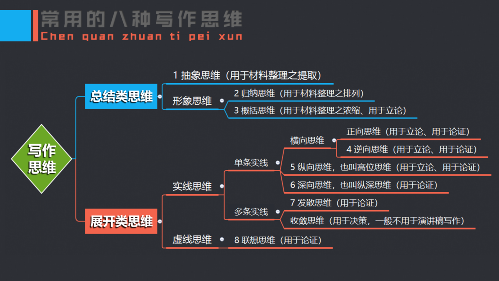

# 表达能力不强，[要训练这五种思维](https://www.jianshu.com/p/5659622754ab)：

逆向思维、高位思维、纵深思维、发散思维、联想思维

​                                2019.01.04 13:16*               字数 3557             阅读 2646评论 63喜欢 69

展开类思维，就是要对自己的演讲主题进行展开论述或者深入探讨时所使用到的思维，它还继续细分为五种：

**一、逆向思维**

> 【相关理论】

根据思维的运行轨迹，可以将思维分为实线思维和虚线思维两大类。其中，实线思维，还分为单线思维和多线思维两类。而单线思维，它又继续细分为横线思维、纵向思维、深向思维等三种。

至于横向思维呢，它主要有两种模式，一为正向思维，一为逆向思维。

什么是正向思维？它是指沿着某些常规去分析问题，按事物发展的规律进行思考、推测，提出自己的观点、并证明自己观点的思维方法。比如，“勤劳致富”这样的论题。

由于正向思维所产生的演讲主题几乎都是我们熟知的、认同的、毫无争议的共识，所以，想把这类主题讲好，并不容易。除非演讲稿中的故事非常感人、语言非常精彩。否则，是很难赢得听众的热烈掌声的。

但是，与之相反的逆向思维却不一样。

什么是逆向思维？它是指一反传统看法、从相反方向思考问题，提出与之相对或相反的观点、并证明这个观点的思维方法。比如，“近墨者未必黑”这个论题。

可以这么说，无论是正向思维还是逆向思维，它们都是立论加论证的一种思维模式。不过，在演讲稿的撰写中，逆向思维更显可贵，这种思维模式更为演讲高手所采用。

为什么这么说呢，因为逆向思维它打破了人们的思维定势，从一般人认为是正常现象、正确观点中发现不足之处，或从传统认为是错误观点、异常现象中发现了真理成分，并对这些统观念进行反思，提出了令人耳目一新的观点。

一言蔽之，逆向思维的主要特点就是对传统思维模式进行逆向思考。比如，在传统思维中，“旧果”是由“旧因”产生的。但是，在逆向思维中，由于时代发展、“新因”出现了，从而否定了“旧果”，并对传统现象进行了鲜明的批判。于是，一个尚未被人们提前知道的新结论就随之产生了。

为了更直观地理解这种思维在演讲稿中的运用，笔者列举如下两个案例，供大家学习和参考。

> **狐假虎威，为何不可？――郑青松**
>
>  “成语‘狐假虎威’出自《战国策》。狡猾的狐狸借老虎的威风吓唬百兽，比喻为借别人的威势欺压人。”我认为这个成语解释对狐狸的评价是不公平的。
>
>  何为狡猾？狡猾为诡计多端不可信任之意。
>
>  这个故事的开端是“虎求百兽而食之，得狐。”老虎得狐无疑是为了充饥。在这种弱肉强食的情况下
>
> ，弱者只有两条路可以选择：一条是想方设法，战胜强者，保存自己，就像故事中的狐狸那样，说：“子无敢食我也，天帝使我长百兽，今子食我，是逆天帝命也。”几句话就把老虎唬住了。继而，进一步争取主动：“子以我为不信，吾为子先行，子随我后，观百兽之见我而能不走乎？”从而摆脱了丧命的险境。
>
>  另一条路就是服服帖帖地让老虎吃掉。如果说前者是狡猾的话，那么唯有让老虎吃掉才对吗？
>
>  我认为，狐狸这个弱者，在被老虎这个强者猎取的一瞬间沉着清醒，思维敏捷，想出绝妙的对策，这正是狐狸的大智；继而，它敢于领着老虎走进森林，临危不惧，这正是狐狸的大勇，由于狐狸的大智大勇，才由被动转化为主动，从而战胜强敌，保存了自己。这怎么能说是狡猾呢？
>
>  何谓欺压？系欺负压迫。这个说法用于狐狸也不确切。狐狸领着老虎走进森林，他的目的是借老虎的威风吓走百兽吗？是让百兽屈服于自己吗？显然都不是。狐狸之所以领着老虎走进森林，是“兽见之皆走”，不过是脱身的一种权宜之计，是为了摆脱自己的危险处境罢了。
>
>  因此，我对这条成语的解释是：狐狸能够运用巧妙的对策，战胜凶恶的老虎，这正说明了狐狸的聪明、机智和老虎的愚蠢。这叫借虎之威，制胜于虎。

> **“东施效颦”，何错之有？――佚名**
>
> 成语“东施效颦”出自《庄子·天运》。其故事大意为：春秋时期，大美女西施因为心口疼痛而皱着眉头在邻里间行走，后来被一位丑女人看见了，这位丑女人认为皱着眉头走路的样子很美，于是回去之后，她也开始皱着眉头走路了……
>
> 这则成语讽刺了那些不知自丑，不识时务的人，只知道盲目效仿，结果却适得其反，沦为人们的笑柄。
>
> 但我并不以为然，理由如下：东施固然丑拙，但她为什么不学南施、北施、中施，单单学习西施？这至少可以说明，她的心目中，对于什么是美是很清楚的。在这一点上，东施至少比生活中那些不知美丑，甚至以丑为美、以美为丑的人要好得多。
>
> 同时，东施不但知道什么是美，而且有追求美的勇气和决心。她不怕嘲笑、不怕挖苦，勇敢的追求美，有什么错？有什么可嘲笑的呢？在这一点上，她不是比那些对西施的美心怀妒忌，乃至进行无聊中伤、恶意诽谤的人也要好得多吗？
>
> 尽管说，在成语中，西施永远是美的，东施永远是丑的，但在现实生活中就不一样了，西施固然天生丽质，但如果不注重自重，而是以美为资本，追求放纵享乐，“美”即成了“丑”，一旦美色早褪，人未老珠已黄，更是无“美”可言了。反之，东施如果保持自尊、自重、自立、自强，并注意提高自己的内在素质，是可以改变自己在人们心目中的“丑”形象的。
>
> 所以，无论是美如西施者，还是丑如东施者，人人都有追求美的权利，从这一点而言，东施效颦无可非议。人同此理，事同此理，即以马拉松比赛而言，冠军与倒数第一相比，水平相差悬殊，但追求成功的权利却都是一样的，能说倒数第一名在跑道上的坚持，是拙劣的效颦吗？
>
> 另外，东施丑拙，虽是先天不足，但其追求美的后天努力也还是无可非议。东施效颦记叙的是一次不成功的效仿，但谁又是天生的成功者呢？只要勇于向榜样学习，就会由模仿走向创新，由不成功抵达成功。
>
> 不是吗？回想“改革开放”之初，我国没有轿车、彩电的流水生产线，我们也曾买来样品仿造，买来零件按图组装，也有过一个产品在市场上屡遭讥讽的“效颦”式的过程，但是现在，我们不是有了“神六”、“神七”吗？在这一点上，东施的勇于效仿不是值得我们学习的吗？

> 【训练步骤】

学员首先找来一部成语词典或者俗语词典。

> 之后，从中挑选出一条观念已经过时或者传统释意原本欠缺的成语或俗语，反其原意而立论。
>
> 接着，按照“传统释意、情节复述、逆向辨析、新意立论、展开论述”等五个环节进行演讲稿撰写。
>
> 最后，登台演讲。演讲结束时，要接受其他学员的批驳并与之进行辩论。

> **【辅导心得】**

多年的培训实践证明，逆向思维训练是最受学员欢迎的训练方式之一。当导师宣布训练开始、有学员冲上讲台、往讲台中间一站时，台下的学员就无比兴奋了。特别是碰到观点独特、论证周密且慷慨激昂的陈述，随着台上台下的频繁互动，培训现场的气氛更是热烈高涨。

不过，值得注意的是：在培训现场，作为训练导师，一定要把控住学员的思维轨迹。

> 首先，要选对短语（成语或俗语），再对其传统意涵做出否定式的逆向立论。也就是说，最好选取那些观念落后或者思想即将过时的短语作为训练材料。
>
> 其次，要善于引导学员的思想倾向。也就是在学员上台之前，要反复强调：新的逆向立论必须比原先短语（成语或俗语）的见解更加深刻、对现实更有积极意义。
>
> 最后，在进行逆向论证的时候，要坚持“多分论点多角度”的论证方法。也就是要紧紧围绕着自己的观点，采用多个分论点对其进行论证。

为什么要强调如上三点呢？因为只有达到这些要求，我们的训练才有助于提高我们的思维水平。反之，如果仅仅提出一个干巴巴的观点再加上几句不痛不痒的话。那这样的训练，往往不仅失之肤浅，而且还很容易将训练现场变成“抬杠”比赛，就大大降低训练的价值了。

所以，在训练的过程中，不能出现如下几种情况：

> **1、曲解**。逆向思维的主要特点是对传统意涵进行反向立论，它必须建立在原观念的基础上。如果我们误解了所选短语的本意并对其进行逆向立论，那我们进行的就不再是逆向思维训练了。就算陈述再精彩、表演再声情并茂，也是不合格的。比如，曾有学员将“开卷有益”理解为：开卷考试不论对学生还是对老师来说都是有益的。于是，他对“开卷有益”做逆向思维立论时，就以“开卷无益”为观点，然后从“闭卷考试才能考出学生的真实成绩”的角度展开论述。不难看出，这样的陈述已经失去逆向思维训练的意义了。
>
> **2、狡辩**。即对自己的训练主题不做选择、也不做深入思考，只要抓住任何一个短语，就开始对其进行“霸王硬上弓”式的逆向思维论证，体现出一种“无所不辩、无所不能”的狡辩精神。比如，有学员看到“善有善报，恶有恶报”这个成语、就对其进行逆向论证，将观点确立为“善有恶报，恶有善报”。尽管说，他的陈述横贯古今，看似有理有据，但从思维训练的角度来看，它还是属于比较表面化、浅层次的思考方式，这种立论还是不足取的。
>
> **3、消极**。原短语（成语或俗语）本来对人生具有积极的意义，起到警世的作用。但有学员也对这样的短语进行逆向立论，结果，积极的短语反倒被改成了消极的短语。比如，有学员将“亡羊补牢，为时未晚”改为“亡羊补牢，为时已晚”去进行主题演讲。你说，这个能行吗？

总之，利用逆向思维撰写演讲稿，观点必须有理有据，论证要求自圆其说。否则，这个陈述就是信口雌黄、哗然取众。

