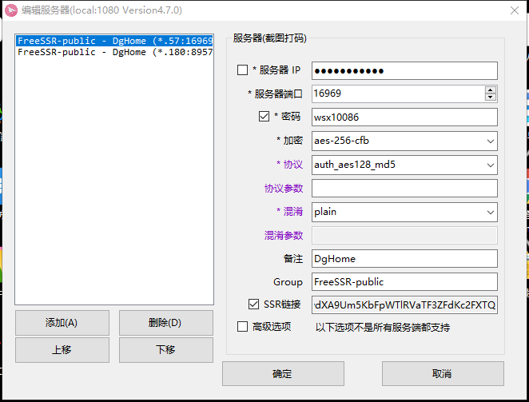

<<<<<<< HEAD
## ShadowsocksR-dotnet4.

202.182.101.180

8957

Nuget@wsx7

aes-256-cfb

auth_aes128_md5


plain


DgHome

FreeSSR-public

ssr://MjAyLjE4Mi4xMDEuMTgwOjg5NTc6YXV0aF9hZXMxMjhfbWQ1OmFlcy0yNTYtY2ZiOnBsYWluOlRuVm5aWFJBZDNONE53Lz9vYmZzcGFyYW09JnJlbWFya3M9UkdkSWIyMWwmZ3JvdXA9Um5KbFpWTlRVaTF3ZFdKc2FXTQ


---

λ .\client_windows_amd64.exe -r "202.182.101.180:18957" --key "Nuget@wsx7"   --mode "fast2"  --mtu 1350 --sndwnd 1024 - -rcvwnd 1024


---





---

## Old


λ .\client_windows_amd64.exe -r "45.77.10.57:19696" --key "wsx10086"   --mode "fast2"  --mtu 1350 --sndwnd 1024 --rcvw

n d 1024

E:\devDg\dgMap


```

.\client_windows_amd64.exe -r "45.77.10.57:19696" --key "wsx10086"   --mode "fast2"  --mtu 1350 --sndwnd 102 4 --rcvwnd 1024


```


E:\Users\PowerDG\Downloads\cmder_mini
λ .\client_windows_amd64.exe -r "202.182.101.180:18957" --key "Nuget@wsx7"   --mode "fast2"  --mtu 1350 --sndwnd 102 4 --rcvwnd 1024


----

1001

36996

---

## PAC

https://www.cnblogs.com/dsdr/p/7389328.html

【PAC模式】：也就是智能分流模式，根据规则去匹配你访问的网站，仅加速国外网站，国内网站不受影响，非常智能；


优点：节省流量，国内网站依旧走本地网络，速度快，绝大部分国外网站都走代 理，速度也快。

缺点：少部分国外网站不走代 理，无法起到加速效果，甚至无法访问（解决方案：自己[编辑PAC规则列表](http://my.36fy.com/knowledgebase/17/user-rule.html)，将不走代 理的国外网址加入进去，或者直接选择全局模式）。

【全局模式】：国内、国外所有网站都走代 理。

优点：可访问全球所有网站。

=======
## ShadowsocksR-dotnet4.

202.182.101.180

8957

Nuget@wsx7

aes-256-cfb

auth_aes128_md5


plain


DgHome

FreeSSR-public

ssr://MjAyLjE4Mi4xMDEuMTgwOjg5NTc6YXV0aF9hZXMxMjhfbWQ1OmFlcy0yNTYtY2ZiOnBsYWluOlRuVm5aWFJBZDNONE53Lz9vYmZzcGFyYW09JnJlbWFya3M9UkdkSWIyMWwmZ3JvdXA9Um5KbFpWTlRVaTF3ZFdKc2FXTQ


---

λ .\client_windows_amd64.exe -r "202.182.101.180:18957" --key "Nuget@wsx7"   --mode "fast2"  --mtu 1350 --sndwnd 1024 - -rcvwnd 1024


---


---

## Old


λ .\client_windows_amd64.exe -r "45.77.10.57:19696" --key "wsx10086"   --mode "fast2"  --mtu 1350 --sndwnd 1024 --rcvwn d 1024

E:\devDg\dgMap

E:\Users\PowerDG\Downloads\cmder_mini
λ .\client_windows_amd64.exe -r "202.182.101.180:18957" --key "Nuget@wsx7"   --mode "fast2"  --mtu 1350 --sndwnd 102 4 --rcvwnd 1024


````
.\client_windows_amd64.exe -r "45.77.10.57:19696" --key "wsx10086"   --mode "fast2"  --mtu 1350 --sndwnd 102 4 --rcvwnd 1024

````


----

1001

36996

---

## PAC

https://www.cnblogs.com/dsdr/p/7389328.html

【PAC模式】：也就是智能分流模式，根据规则去匹配你访问的网站，仅加速国外网站，国内网站不受影响，非常智能；


优点：节省流量，国内网站依旧走本地网络，速度快，绝大部分国外网站都走代 理，速度也快。

缺点：少部分国外网站不走代 理，无法起到加速效果，甚至无法访问（解决方案：自己[编辑PAC规则列表](http://my.36fy.com/knowledgebase/17/user-rule.html)，将不走代 理的国外网址加入进去，或者直接选择全局模式）。

【全局模式】：国内、国外所有网站都走代 理。

优点：可访问全球所有网站。

>>>>>>> f06987277737098e8bf42d04b2262fe3d06e0d8a
缺点：所有网站都走代 理，访问国内网站速度变慢，且耗流量。