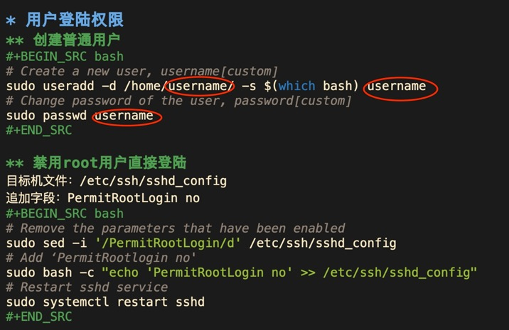
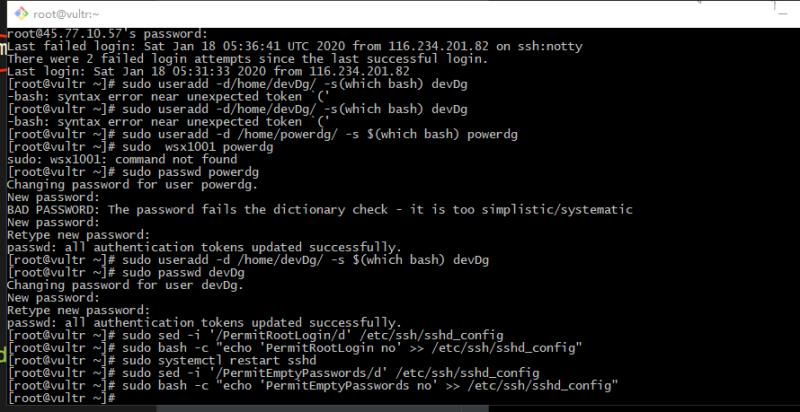

sudo useradd -d /home/powerdg/ -s $(which bash) powerdg

sudo passwd powerdg

---

sudo sed -i '/PermitRootLogin/d' /etc/ssh/sshd_config

sudo bash -c "echo 'PermitRootLogin no' >> /etc/ssh/sshd_config"

sudo systemctl restart sshd

sudo sed -i '/PermitEmptyPasswords/d' /etc/ssh/sshd_config

sudo bash -c "echo 'PermitEmptyPasswords no' >> /etc/ssh/sshd_config"

sudo systemctl restart sshd

