有哪些事情，你去了上海才知道？ - 朱颜的回答 - 知乎
https://www.zhihu.com/question/287833567/answer/478413602

作者：朱颜

## 1 便利店

上海便利店极多。就我所见到的，品牌就有全家、罗森、可的、良友、7-11、喜士多、快客、光明，好德等。其中又似以全家最受欢迎。全家的密集程度举个例子，祁连山南路地铁站，出口处有一家。进入地铁站内又有一家，相差只隔几十米。北新泾至淞虹路这一段的天山西路上，便利店相当多。全家24小时营业，罗森不是。便利店早餐较贵，鲜肉大包2.8元，糯米烧卖2元。全家和罗森里面有速食便当售卖，在微波炉里加热后即可。陆家嘴那边的白领，就是公司附近没有平价的餐馆，就去吃便利店里的便当。全家还有早餐套餐，10元一份的三明治＋酸奶。

另外每个加油站旁边都有一家易捷便利店。另外最近有猩便利的24小时无人线下便利店。漕河泾腾讯研发大楼下就有一家。

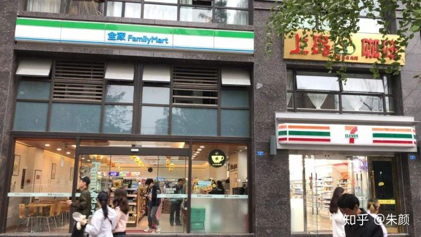

## 2 地铁

上海地铁以市中心为起点，发散出去的射线。又有四号线，基本和内环重合，是换乘的节点。但也造成换乘都需要进内环换乘。中环去中环（真北路去漕河泾），外环去外环的（丰庄至莘庄），乘坐地铁绕远。但有公交作为补充。例如祁连山南路地铁站，去往淞虹路。真北路去往北新泾都有直达的公交。浦西的地铁密度明显高于浦东。

上海目前开通的线路如下：

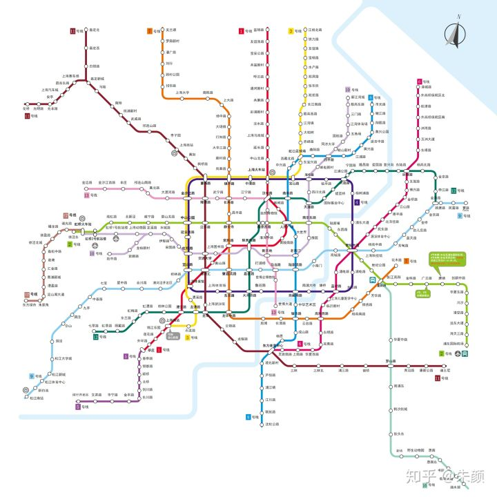

从1号线编号到17号线，再加上磁悬浮和浦江线。总共17条线在运行。14号线和15号线还在建设中。

这17条线路中，我除了磁悬浮，别的都乘坐过。分别点评下吧：

1号线是从闵行莘庄到宝山富锦路。它最早建设开通，车厢最旧一些。在徐汇的那几站，都是比较破旧的地铁站，刷卡进去就是站台，连站厅也没有。北面在宝山那些站是高架站。1号线经常坐的是上海火车站到上海南站这一段，比坐3号线快。1号线坐的比较少。

2号线是浦东国际机场到青浦徐泾东。2号线是东西走向的大动脉。一路上海的地标都关联起来。以前在张江时就从广兰路进城里。现在会从北新泾出发往市区坐。回家则是从北新泾一直坐到虹桥火车站。2号线很熟悉。2号线有大小交路，有的车次只到淞虹路。广兰路到浦东国际机场这一段其实是单独运营的。

3号线从宝山江杨北路到上海南站。这个也经常坐。从虹足到宜山路这一段坐的很多。3号线北面一段都在高架上。在金沙江路站其实可以看到牌子：明珠线。3号线也有大小交路。只到长江南路。

4号线：环线。从宜山路到宜山路。换乘都靠它。然后它并不是拥有换乘站点最多的线路。分为内圈和外圈运行。我经常坐的是北面半圈，从宝山路到宜山路这一段。刚好也是和3号线完全重合到一段。4号线上的两站，走内圈和外圈都是相同的站数的话，是走内圈快，还是外圈快呢？考虑下，从中山公园到世纪大道，怎么走最快？

5号线。完全在闵行。连接一号线末站莘庄到闵行开发区。这个线路坐过一次。是今年三月份为了体验浦江线坐到沈杜公路，然后从那坐公交经闵浦大桥，到吴泾镇，然后逛了下闵大荒的两所大学，回市区就坐的5号线。这个车下午3点多坐的，人很多。5号线南延伸段18年12月30日开通了，奉贤终于有地铁了。准备去体验下从空中过黄浦江的风光

6号线。完全在浦东。从外高桥保税区一直到东方体育中心。基本沿着黄浦江沿线。6号线坐的少，从世纪大道去金桥。这个车的容量比较小。记得坐的时候很挤

7号线。从宝山美兰湖到浦东花木路。7号线坐的也不多。以前去美兰湖玩，坐的是它。这个线路给我感觉出了内环，从镇坪路开始，就没有换乘，导致一直往北人越来越多。

8号线。从杨浦市光路到沈杜公路。这个坐的多。有虹足、人广、大世界、梅赛德斯等地标。这个从虹足到耀华路这一段经常坐的。终点站沈杜公路去过，可以从那坐公交去黄浦江对面的吴泾镇，能看到一个很大的烟囱。沈杜公路很多奉贤过来的人。

9号线。从松江南站到浦东曹路。基本横跨整个上海东西了。曹路都到海边了。9号线最近经常坐。松江段坐过，有几站之间距离特别长，感觉都有6公里左右。9号线应该是人最拥挤的线路。因为松江出发可以一部头到漕河泾、到徐家汇等。很多新上海人买房买在松江地铁沿线。

10号线。从杨浦江湾到闵行虹桥火车站／七宝。这一个线路基本经过的都是市区繁华地段。最近龙溪路站经常坐

11号线。从嘉定／昆山花桥到浦东迪斯尼。这个是上海最长的线路了。11号线一路从嘉定过来，人也是很多，通勤线路。新上海人买房也喜欢在嘉定，花桥。11号线和10号线一样都有支线。11号线的嘉定西、嘉定北两站中的嘉定指的是嘉定镇街道，而不是嘉定区。

12号线。从浦东金海路到闵行七莘路。这个是换乘王。而且目前看来舒适度挺高，不是很拥挤。在漕河泾那边有个虹梅路站，有时候不想挤9号线进市区，就骑个自行车坐12号线。

13号线。从嘉定金运路到张江。这个线路人比较少的。而且从金运路出发，很快就能进内环（7站到金沙江路站）。经常坐的是金沙江路到祁连山南路站。金运路那边有个万达。18年12月30日二期和三期都开始运营了，直接从嘉定一部头地铁到张江，很方便

16号线。这个中秋趁着休息，从普陀，坐了好久的地铁跑到龙阳路体验。其实就是南汇的通勤线。分大站车和小站车。大站车快12分钟。我坐到的车厢才三节，座位是类似公交车的那种。站与站之间的时间很长，因此只坐到惠南镇，就坐回去了。沿路都在高架上，两边看到的除了农田还是农田。农田间散落的独门独院的农家小院，很像我老家乡下的房子。

17号线。除了终点站虹桥火车站，其他都在青浦。是青浦进城的唯一线路。和9号线，11号线不同，它不进市区，是郊区线，整个跑完46分钟。这个17号线我经常坐。基本上每个站我都出站看过。朱家角、东方绿舟、嘉松中路（奥特莱斯）都去玩过。东方绿舟离我老家不足30公里。17号线和2号线的换乘是同站台换乘，最省力了。期待17号线继续向西延伸到金泽镇。

浦江线。从沈杜公路站继续往南延伸。全程都在闵行浦江镇。刚开通时去坐过，无人驾驶很酷，坐在车头能看到不一样的风景。

需要出站换乘的：南京西路站（2/12/13，都不能站内换乘），上海火车站（3/4转1），龙华站（11转12）

## 3 生活特色

上海爷叔阿姨，出门爱带一个双轮的小推车。用于负重买菜。上海阳台伸出去的长方形钢栏，用竹竿伸出去晒衣服。到了晚上，有不少阿姨喜欢穿着睡衣散步。上海虽然物价贵，例如一碗大排面要卖到15元。但是针对上海本地人，其实是有廉价的食肆的。曾经在虹口和闸北交界的虬江路上买到过8毛钱一个的茶叶蛋。来上海之后，对于物价的接受程度是逐渐提高的。14年刚来上海，和同学一起在南京东路吃了碗爆鱼面，18元，当时觉得好贵。现在看来还可以接受范围。

在四川北路步行街，靠近长春路那边。有家新海食品商城。经过那边的时候，总有很多上海阿姨爷叔在排队买东西。看了下里面的价格比较实惠。然后还时不时清仓处理，临近保质期，还有一两个月过期的饮料食品等低价售卖，6听啤酒卖7元钱。

四川北路上还有书店，卖书是论斤卖的。其实并不怎么便宜。

四川北路是老牌的购物地点，现在可能人气不行了。

作者：朱颜

5 市区

浦西城区形如蝴蝶，共8个区。老静安为最中心。以静安为圆心，从西到东顺时针分别为长宁、普陀、闸北、虹口、杨浦、黄浦、徐汇。 其中苏州河以北四区：普陀、闸北、虹口、杨浦。苏州河以南四区：长宁、徐汇、静安、黄浦。 另浦东中环内城市化也较高，也被视为市区的一部分。浦东面积极大，是合并了川沙和南汇后的情况。

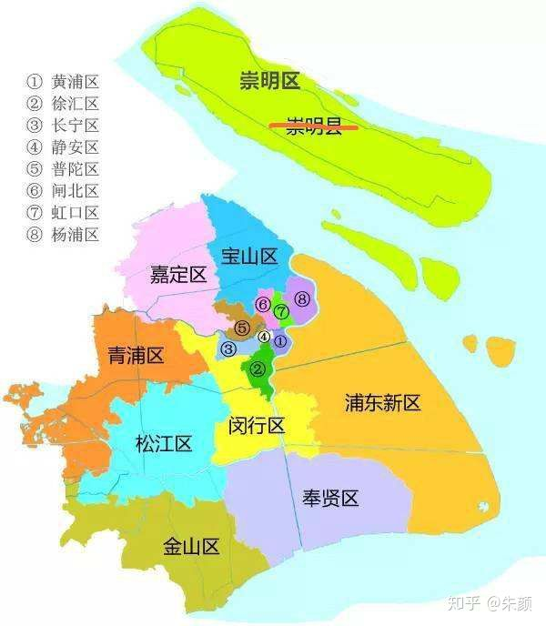

6 郊区

上海郊区按照距离市区距离远近，分别是闵行、宝山、嘉定、松江、青浦、奉贤、金山。另外还有一个崇明岛，距离南通启东很近。

其中又分近郊，远郊。近郊为闵行、宝山、嘉定、松江。闵行有中环部分：虹桥镇。且跨黄浦江，浦东有一浦江镇属于闵行区。虹桥枢纽就在闵行。宝山有中环部分：大场镇。嘉定有外环内部分：真新街道、丰庄。松江区距离市区最近的为九亭镇，紧靠嘉闵高架。青浦区距离市区最近的为徐泾镇，紧靠嘉闵高架。奉贤区整个都在黄浦江以南，距离市区最近处为西渡镇。金山是除崇明外，距离市区最远的郊区。

松江的浦南三镇，基本上都是上海土著

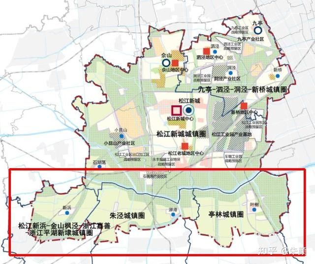

7 网红及排队

上海主打消费主义。各种网红食品、网红餐厅、种草拔草。以门前人流涌动，排队队伍长，证明人气之高。网红食品有脏脏包、青团、喜茶等。朋友圈晒时必须的。

8 演唱会、音乐会

上海演唱会场次极多。人气高的歌手，一般在浦东世博旁的梅赛德斯开。例如邓紫棋、张靓颖、徐佳莹、梁静茹。另外虹口足球场也是众多之选，例如萧敬腾、莫文蔚。较小众的歌手，会选在美琪大剧院、MaoLive、虹馆EH等地点。东方艺术中心一般是钢琴演奏：例如天空之城等，邓丽君的翻唱者一般也选择此。邓丽君的翻唱真的好多。票牛上能查到的就有4个。梅塞德斯那边曾经看到有人买了黄牛假票，票面显示3号门，然而梅塞德斯的入口是以ABCD这些字母命名的。火箭少女在2019年1月12日，在梅赛德斯奔驰开了演唱会，然而我刚好在重庆团建，完美错过 

9 话剧／音乐剧

上海话剧音乐剧场次极多。对个人而言，音乐剧以复兴中路的上海文化广场的百老汇原版音乐剧最佳，场面极震撼、英文演唱极富感染力。本人看过的音乐剧《魔法坏女巫》《保镖》《金牌制作人》《西区故事》等。上海文化广场靠近陕西南路地铁站，一出地铁站黄牛极多。话剧个人最爱华山路上的上海戏剧学院的开心麻花喜剧。最近看了孟京辉的《恋爱的犀牛》，感觉打开了新世界的大门。最近看了两部英国闹剧《演砸了》《糊涂戏班》，都很好看。

10 商圈/商业中心

上海购物地点极多。我去过的有。长宁巴黎春天、龙之梦、西郊百联。虹口龙之梦、四川北路。普陀梅川路步行街、中环百联、环球港。闸北大悦城。徐汇徐家汇。沿2号线，静安寺、南京西路、南京东路。浦东张江长泰广场。青浦奥特莱斯。

梅川路步行街的标志性建筑，随手抓拍

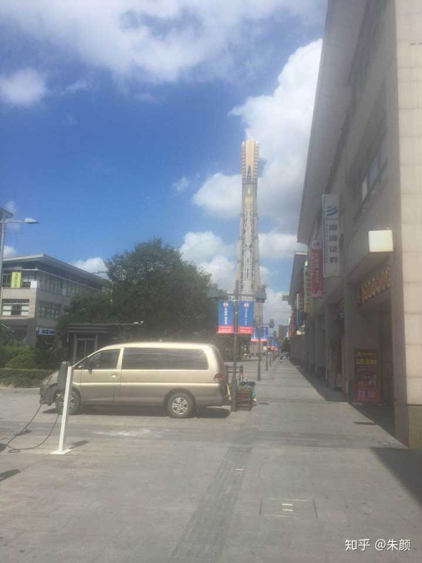

11 铁路／高铁

上海铁路极发达。只讲客运方面。有三大火车站：上海站、上海南站、上海虹桥站。上海站主要承接沪宁方向来的火车，在内环以内。上海南站主要承接沪杭方向的火车。上海虹站两个方向都承接。虹桥站最新，气势最大。另有多个小站。沿沪宁方向分别有上海西站、南翔北站、安亭北站，都在11号线上。沿沪杭方向有松江站、松江南站，都在9号线上。另上海南站有开往金山卫的动车。票价10元。分直达车、大站车、小站车。最快30分钟。因为上海的强势，从苏南往浙江方向必须经过上海中转。通苏嘉这样绕过上海，直接贯穿苏南浙北的线路就尤为珍贵了。还有沪苏湖高铁，直接走湖州线。期待这两条经过吴江的线路的贯通。

上海火车站的铁轨终点在宝山路地铁站那，在地铁站二楼可以看到正下方的铁轨。

货运铁路，在宝山那块很多。铁轨和城市道路交叉的地方，采取交替运行的方式。白天有专人值班道口。

12 租房

上海房价本已高企，租房相当贵。租房分几种：整租、合租、群租。整租是一整套全部租下，例如情侣租个一居室。或者同学之间毕业后整租一套，一人一个卧室。合租和整租区别是，整租是相互认识的。合租是后来找室友的。群租则是对房子原有结构进行改动，一般把客厅隔断成多个房间。上海房屋中介相当多，链家、悟空找房、中原地产等，找中介需收35%的费用，且是租客、房东都收取。不愿经中介的，可以在58、赶集上找，但中介伪装成个人的相当多，打电话过去说房子刚被看走，有没有兴趣看套其他更好的。但豆瓣上有对应的租房小组，这上面是个人的，但仍有中介伪装。若有办居住证或者落户的，租赁备案是必须的。有这方面需求的，找房时就须与房东说明。因为办租赁备案是要交税的。有些房东并不愿意。这是我在小区里中介随手给我的广告。大家体会下。所以上海的房价是真的高，有人说上海租售比很低，所以房租上涨不足为奇。但租售比很低的原因难道不是上海房价畸高么？上海租房一般是押一付三，就是首次租它这套房，需要给房东一个月押金，并支付后面3个月的房租。等到租期满，房东在验收房子，结清水电费之后就会把押金退还给租客。好说话、不计较的房东在租期内都不会涨价，但带我看房的中介说在上海，房东一年可以涨三次房租，不知道是真是假。

现在上海出现了蛋壳自如的长租公寓，押一付一即可，但每月价格实际较贵。且需要交服务费，有公寓管家。

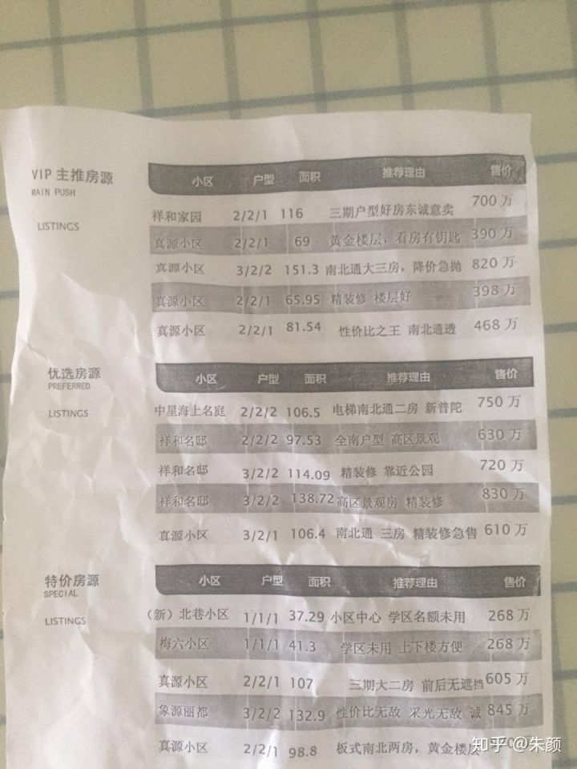

15年的时候在公交车上听到两个老太在讨论，一个对另一个心满意足的说：十年前丰庄的房价才五六千，当时买的真划算，现在一套的房租就能收到这个价。

最近在地铁站看到的租房广告。一室户9000元。

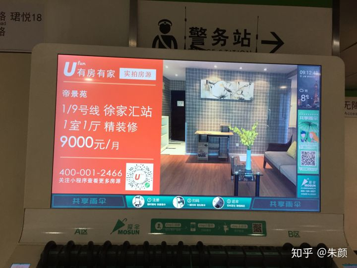

13 无现金支付

上海无现金支付程度较高。商店中都是微信支付、支付宝支付。以前公司楼下卖烘山芋的小贩都搞了个二维码微信支付。几百块现金可能几个月都用不掉。支付宝及微信支付，都定期有奖励金。但也有只收现金的场景，例如加油站加油。曾目睹有人加油没带油卡，又无现金，被工作人员怒斥的场景。

14 城市化

上海城市化程度极高。地铁四通八达。市区自不必说。骑车一览即知。各种郊区也有自己的商业中心。例如11号线末端的嘉定老城区（嘉定镇），各种商业配套都有，有州桥老街，还有大学城，为护城河所环绕。又例如9号线末尾的松江老城区（松江），环境很好。这两处都离市区有三十多公里。嘉定南翔和安亭曾去过。南翔街道很干净，满街都是小笼包店，有南翔老街。安亭在嘉定与昆山界，汽车产业发达，目前房价平均三万。

15 高架

上海高架有内环、中环、外环，绕城、南北高架、延安路高架、嘉闵高架、虹梅南路高架等。上海因人口众多，2200多万人，私家车保有量也众多。因此地面交通在高峰期十分拥堵。因此只能采用高架，在高度维度处理。内环基本与4号线重合。南北高架很重要。中环限速80。中环的口子有金沙江路出口、北新泾出口、仙霞路出口、吴中路出口、漕宝路出口等。沪c的车牌有限制，牌子很便宜。其他户牌需要竞拍。我同事今年拍到，8万多块钱。高架缩短时空距离。例如真北路地铁站到漕河泾地铁站，坐地铁需要辗转9站三个线路，将近50分钟才能到。而走高架只需要10到15分钟。

[高清上海高架地图.pdf_微盘下载vdisk.weibo.com](https://link.zhihu.com/?target=http%3A//vdisk.weibo.com/s/AZxV1vRRwu1r%23_loginLayer_1535347665770)

上次去嘉兴旅游时，问出租车司机嘉兴啥时候会有地铁。师傅说造地铁需要市区人口多。嘉兴连高架都没有，就更不会有地铁了。一个城市肯定是先有高架，才会有地铁。高架和地铁都是为了解决地面交通拥堵的问题才出现的。

红线中为，沪C的限行路段

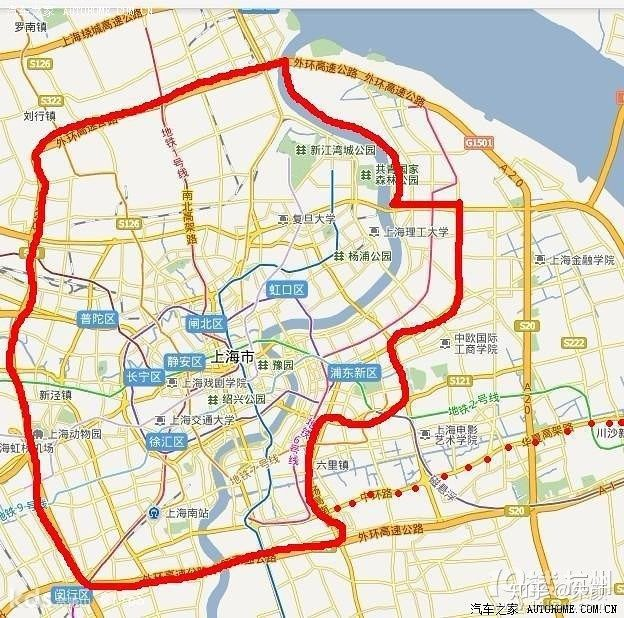

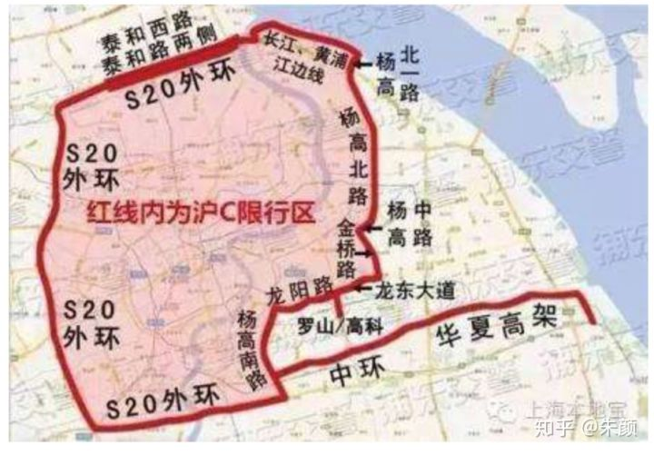

同普路被中环分隔成东西不通的两段

16 房价

上海二手房交易远超新房。上海房价，在15年之前，属于尚可承受的范围。当时新上海人在上海买房，并不严格需要上海户口。如果是夫妻买房，只需要上海社保满两年即可。当时房源提供量大的松江和嘉定的均价还不足两万，南翔、七宝、九亭还可以接受。15年开始经历了一波猛涨，松江现在松江老城区、大学城等都接近4万，嘉定现在如嘉定镇、安亭都是3万。购房政策也变得严格，如果没有上海户口，单身是无法买房的。夫妻变成了5年。15年之后，新上海人买房的地段离市中心越来越远。松江范围 从九亭变到了洞泾、泗泾（松江在黄浦江以南的三个镇，应该还没人考虑，因为交通不便，且是规划控制区）。嘉定则从南翔变成了安亭、嘉定镇。浦东购房的，则是2号线延伸线的唐镇、川沙。9号线到海边的曹路镇。17号线青浦线开通后，赵巷、青浦城区、朱家角的房子也被纳入考虑范围。至于住在金山城区，每天乘坐动车去城区上班的，笔者十分佩服他们的毅力。新上海人一般是大学毕业来上海奋斗打拼，公司一般在市区，因此咬牙买了这些偏远地方的房子后（还好有地铁！），每天光在地铁上所需要花费的时间至少在1小时，有的甚至长达1.5小时。由于11号最后三站在昆山花桥境内，那些没有资格在上海买房的，就先在花桥买。坐地铁到花桥站，中介络绎不绝。由于苏州限购导致花桥也被限购，因此南通的启东、崇明岛上的永隆两镇，浙江的嘉善、平湖等地又被炒作。这两天在地铁上看到了卖安徽黄山房子的广告，开发商的想象力真是惊人。

上海房价目前靠工资收入已经无法企及。除非夫妻双方家境殷实，长辈们又愿意掏空6个钱包，倾力为其上海购房，才又可能达到。

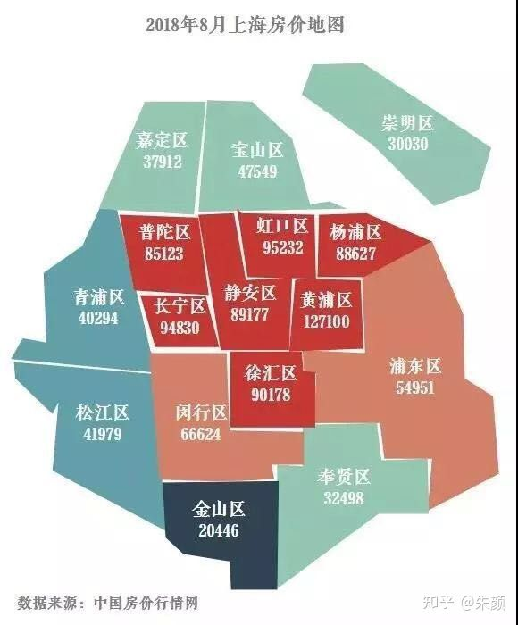

因为房价实在太贵，所以经常在微信朋友圈里看到 苦中作乐的段子。例如有说自己工作了一年就在上海买了套500万的房子。翻到最后，原来是自己工作攒了十万，家里老爸老妈给了490万。其实就是讽刺现在年轻人想靠自己上班，进行原始积累，而没有家庭的支持，是根本买房无望的。

先前在金沙江路地铁站，13号线转3/4号线的通道里，身边的一个年轻人不平地对同伴说：房子本身是给人住的，在上海却变成了金融产品，变成了门槛。想享受大城市的便利、优质资源，好啊，先买房交了投名状才有资格。

北京其实也类似。

[清华硕士集体逃离北京！中科院科研人员： 我为什么离开…www.jianshu.com](https://link.zhihu.com/?target=https%3A//www.jianshu.com/p/2d10d69a650e)

> 关于北京的房价，其高涨的可怕在于，当我以为可以凭借自己的聪明，创造力，上进，等等自身的能力，在北京好好生活下去的时候，现实却残忍地告诉我，你越来越买不起房了…… 

上海的房价扭曲了人性。出现各种怪现象，例如“假离婚”。更有句很魔幻的句子：“只有感情深的，才能放心的离婚”，因为法律上没有任何所谓的“假离婚”。一旦离婚，若一方不怀好意，另一方会极为被动。也有新上海人为了买房和中介结婚的。

见这个帖子：

[上海中介小伙卖房：已和客户结了4次婚 包括70岁老太太finance.sina.com.cn](https://link.zhihu.com/?target=https%3A//finance.sina.com.cn/china/dfjj/2017-03-27/doc-ifycstww1442146.shtml)

年轻人大部分因买房无望，便不作他想，索性把挣来的钱用于消费中，因此消费主义盛行。

17 消费主义盛行

既然已经看穿，知买房无望 ，年轻人便断了这个念想，完全用于消费享乐上。上海消费主义因此盛行。几百块钱的口红，需要集齐每个色号。种草、拔草、打卡是必须的。看演唱会、音乐剧、话剧是比较常见的消遣。咬牙买下一个觊觎好久的包。

18 公园

上海公园众多。举几个去过的。

人民公园，在南京路上。园内最大的特色就是相亲角，然而这个地方只有老年人为其子女相亲。其子女本人并不会在场。进门都是一把伞撑开，上面放着资料，写好自身条件和要求。如同菜场卖菜一样。

世纪公园，在浦东花木路附近。票价10元。公园挺大，有湖有水。

鲁迅公园，就在虹口足球场边上，历史悠久，抗日时期，当年震惊全国的尹奉吉刺杀日本军队要员的事件就发生在这个公园（当时叫虹口公园）。里面风景相当不错，有个湖很大，可在里面游船。最西面有门直通虹足。

滨江森林公园，离市区相当远，在浦东6号线港城路还要往北。是黄浦江汇入长江的口子。园内可烧烤。树木繁多。还能闻到长江水的气息。

共青森林公园，在杨浦。被货运铁路分隔。公园面积挺大。旁边有一渡口至浦东

中山公园，在长宁。园内植被树木众多，且24小时开放。背后是华东政法大学

东方绿舟，算不得公园，但里面植被很多，游乐项目很多。

紫薇公园。张江一个公园，极小。但有湖有假山

祥和公园，在普陀真光路上，也是很小的公园。

另外例如四川北路公园，这些其实就是绿地，并无围栏。

19 高校

上海大学城：松江大学城、五角场大学城、海湾大学城、闵大荒大学城、临港大学城

松江大学城，有很多高校。实际离松江大学城地铁站有一定距离。学校很多。离泰晤士小镇不远。

五角场大学城：有复旦邯郸校区、同济四平路校区、上财。同济大学樱花很好看。

海湾大学城：顾名思义，在奉贤。有华东理工，上海师范等，离市区特别远。

闵大荒：哈哈哈。交大和华师大的闵行校区。都在东川路上。出行靠5号线。旁边是吴泾镇。

交大有货运铁路穿过

临港大学城：临港应该是上海除崇明最偏远的地方。比我老家来上海还远。那边有大学城，但远离地铁站：上海海事大学等。最近的地铁站在6.5公里之外。出行靠16号线这个旅游线

嘉定：同济大学嘉定校区。离市区很远。出地铁站很茫然的，看到的是一座大桥（昌吉东路大桥），货车很多经过。上海大学嘉定校区，在嘉定镇上。11号线嘉定西、嘉定北那块

市区中的大学校区都比较小：我所去过的。普陀环球港对面的：华师大中山北路校区。华师大里有毛主席像。中山公园背后的华东政法大学。张江的上海中医药大学。

市区还有一类老年大学，电视大学，业余大学。在长宁区定西路安化路路口就有个业余大学

20 落户

上海最容易的落户方式是应届生落户。应届生落户采用打分制，72分，包括学生自身条件、公司条件等。本科生毕业，除非特别优秀的，其他是达不到分数的。最近上海实行了清北本科毕业生直接落户。研究生毕业来沪，如果不是上海本地的高校，那还是需要其他加分项，例如专利、优秀毕业生才行。应届生落户步骤极为繁琐。在毕业之前就需要提交一系列材料。提交之后，需要等待审核，看能否收到证明信。一旦拿到证明信，就代表落户的链条，理论上可以完成了。另外还有一个很重要的租赁备案。需要和房东一起，拿着合同去社区服务中心办理。这个就是外部依赖，需要和房东协调。因为这个备案之后，理论上是要交税的。材料准备齐全之后，去租住地的派出所，办理迁入社区公共户。不得不说上海的基层民警，事务处理起来是很快的。只要材料符合，就立刻办理迁入。以前迁入成功之后，可以开具户籍证明，但有效期只有一个月。在2018年5月1日政策变更，社区公共户有了户口卡，可以管3年。在这之前，只要搬一次家，户口就需要迁移走，就是所谓的人随户走。

如果不是应届毕业生落户，那大多数走居转户。也就是居住证转户口。需要在上海居住证84个月才有资格提出申请。

21 张江男静安女

前几年流行的一句话。张江是众多外企例如sap、hp、花旗、ebay所在地，有很多研发哥哥。人老实、挣得多。静安有很多高档写字楼，里面做文员的小姐姐。理工男，配文科女，倒也合适。不过实际是互相瞧不上的感觉。

22 漕河泾

漕河泾处于徐汇和闵行交界的地方。有很多高新企业。例如腾讯、思科、爱奇艺等。有众多的研发园，例如远中产业园。漕河泾本身归于虹梅路街道管辖。漕河泾开发区地铁站，9号线很挤的一站。坐地铁时，可以发现有些男的，虽然看起来年纪不大，但头发皆白，或是秃顶，斑秃。漕河泾就在中环旁边，恐怕是为了方便那些晚上九十点打车回家的加班族们。漕河泾有两个地铁站南北是开放式的漕河泾公园，其实也就是两片绿地而已。周边没什么高档的商场，吃饭一般在虹梅路小吃一条街解决，黄焖鸡、浏阳蒸菜、麻辣烫、冒菜、西北牛肉面、吉祥馄饨等应有尽有。漕河泾往北是闵行区的虹桥镇，是闵行唯一在中环内的部分。虹桥镇核心地段开发的还是很好的（吴中路－延安西路）

23 张江

张江镇有六个地铁站。2号线的张江高科、金科路、广兰路。13号线的中科路、学林路、张江路。金科路旁边有长泰广场。金科路那有个汇智湖，一般吃完中饭，那些研发小哥哥们会坐在湖旁边的椅子上晒太阳。张江镇有很多拆迁安置房（古桐x村），舍得花钱的住在玉兰香苑x期中。张江镇本身挺无聊的，镇上没啥娱乐设施。有一条有轨电车贯穿张江镇。张江有个药谷，医药企业很多。

24 复兴岛

复兴岛有12号线地铁站经过。是黄浦江中一个小冲积岛，属于杨浦区管辖。上面的居住楼不多，大多数是当年的企业厂房。上面有一个小公园。是一个很安静的地方。尽管在市区，但仿佛被遗忘。有人写了个攻略

[复兴岛公园游 小记 - 上海游记攻略【携程攻略】you.ctrip.com](https://link.zhihu.com/?target=http%3A//you.ctrip.com/travels/shanghai2/2349546.html)

复兴岛地铁站应该是中环内人流量最少的地铁站了。我下午2点多出站时，乘客寥寥。

25 碧云街区、老外街、古北社区

一个在浦东金桥，一个在闵行虹桥、还有一个在长宁。都是老外聚集的地方。碧云那边风景优美，时常能看到老外带着小孩在那玩。老外街那边是美食酒吧一条街，老外街刚好是闵行和长宁的分界。那个地方古北是老外高档住宅。上海老外真的很多。

26 生活节奏

上海除了上下班的客流高峰，还有晚上9点左右的人群高峰。地铁里面基本上都站满了人。上海公交车运营时间段一般很长，从早上5点多，一直到晚上11点多。947路晚上10点半的末班车开出来的时候，刚经过中山公园，就坐满了人。947公交车的走向是长宁、普陀、嘉定。很多人都是住在嘉定。每天去市区通勤。上海很多年轻人周一到周五每天加班，晚上回到家九十点钟，看看书之后就是洗洗睡。早上7点多又要醒来赶公交地铁。因此周一到周五就像一天一样快。周六周日则是放松的时间。但有些公司是996，在那些公司的年轻人就更苦逼了。拼多多是早11，晚11，工作6天。说起这个，我14年刚来上海的时候，从我们小镇到上海虹桥的长途汽车里，遇到一个老阿姨，她说去上海看望儿子。她儿子也从事IT，在爱立信工作。她和我说找工作，就找加班多的。加班多的钱就多。趁年轻在上海多加班多挣钱。

中国的老百姓真的是世界上最勤劳的群体了，勤勤恳恳，踏踏实实上班，用自己的汗水浇灌出美好的生活。生活在上海这种快节奏大城市的年轻人，更是令人敬佩。他们大多数背井离乡，一年只有春节才回家，工作占用了他们一天中大部分的时间。用自己的奋斗来交换那提升自己阶层的希望。

早高峰里的地铁站，有人没有提前把公交卡拿在手上进站，导致后面人被延迟时，是被嫌弃的。然后从站台下到站厅的自动扶梯上，如果没有站在右侧，而又不沿着左侧的路一直下去的话，也会被嫌弃，因为挡了别人换乘的步伐。可能上海就是像日本一样，推崇的是管好自己，不要给别人添麻烦。

27 黄浦江、苏州河

黄浦江在上海境内的最上游是青浦，青浦的拦路港及其他河流交汇之后，经松江、闵行、徐汇、黄浦、虹口、杨浦、浦东汇入长江。黄浦江在闵行形成一个90度的拐弯，然后一路向北流去，将上海分成东西两块。闵行区、松江区是唯二跨黄浦江的区。闵行在黄浦江东有浦江镇。松江在黄浦江南有三个镇。黄浦江畔有众多渡口，黄浦江上的桥都不能过行人。过江最便捷的还是坐地铁。目前上海跨越黄浦江的地铁线分别是2号线，4号线，7号线，8号线，9号线，11号线，12号线，13号线。另外10号线会在杨浦北部过江，与6号线港城路连接。5号线则会过江去奉贤区。

苏州河则是吴淞江的俗称，从太湖过来，一路经吴江、昆山经嘉定、普陀、闸北、虹口然后在外白渡桥附近汇入黄浦江。苏州河以南的四个市区＋苏州河北的虹口被称为上只角，苏州河以北的另外三个个市区被称为下只角。上只角的五区：长宁、徐汇、静安、黄浦、虹口，发展的要比下之角的普陀、闸北、杨浦要好。苏州河也把房价给做了自然的区分。苏州河上有很多桥，例如祁连山南路桥、真北路桥、泸定路桥等。

28 上海话

上海话接近苏州话，但又有不同。上海本身各区之间也有差异。最西面青浦区靠近吴江的地方，讲的竟然就是吴江话。苏州人听懂上海话没问题。上海话里的“大转弯”，“小转弯”还是蛮形象的

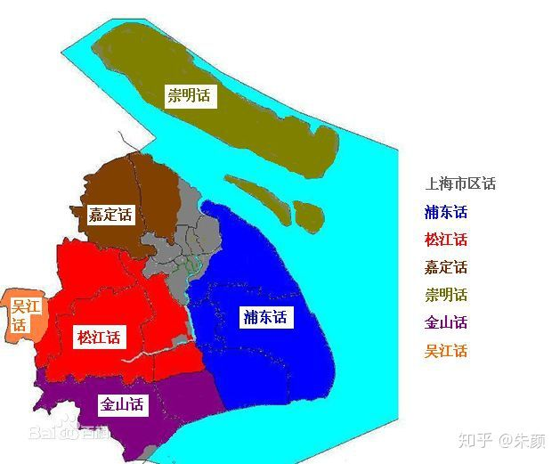

29 上海公交站

上海的公交站不以地标来描述地点。而是通过两条马路交汇的地方来描述。但不同线路会出现同名的公交站，例如光是中山公园站，就有好几个点。分布在汇川路、长宁路，初次来的时候很难寻找。某地若叫A路B路，则表明这个地方是在A路上，但靠近B路。A路和B路一般是垂直的两条路。因此如果说去外滩，司机很可能迷惑。需要说是中山东一路汉口路。另上海有不少单行道。很多公交线路因此上行站和下行站并不是在马路的两侧（例如947路的中山公园站）。上海的公交站一般有车辆经过信息，到站还有几站多少分钟。很贴心。

30 上海虹桥枢纽

虹桥枢纽位于闵行和长宁交界的地方，属于华漕镇拨出来的地。虹桥机场一半属于长宁区。虹桥火车站则在闵行。另外虹桥机场和火车站其实是在一幢大楼里，步行是直接可达的。距离大约七八百米。因此当虹桥火车站因为客流太多，导致进地铁站很缓慢时，可以通过步行至虹桥机场2号航站楼进地铁站，那边客流很少。另外虹桥还有长途客运站，大量的班次发往苏州、南通、嘉兴的乡镇。

从淞虹路地铁站沿着天山西路往西到华漕的路上，一路上都能望见空中飞机很近。声音挺响。华漕和江桥这两个地方最近我都骑车去过了，虽然离市区直线距离很近，但城乡结合部的地方，实在有点破。

31 营销活动：七夕、618、818、517、情人节、世界杯等

不光是上海，其实各大电商会绞尽脑汁搞促销。大众点评网每年都有517，917，谐音我要吃，就要吃，是这家公司很重要的营销活动。另外例如214 情人节、314白色情人节，七月初七七夕，都是营销时机。真所谓月月都有情人节。另外购物电商如京东、苏宁则是618、818打折，特别是3c电器打折很多。今年恰逢世界杯，各种营销活动层出不穷。现在大部分互联网公司都是运营驱动。另外公司也会有节日福利啊，例如七夕节给员工发巧克力呢

32 广告投放

   电梯广告、公交车广告、地铁广告、线上广告

上海电梯中都有广告，有分众传媒的显示屏。还有固定的类似壁画的东西。公交车广告则是车身两侧大块都被广告覆盖。例如亲子畅玩卡、奇妙日等。公交车广告下线比较滞后，活动本身结束一个月了，车身广告仍然未换。地铁广告，分地铁站内广告和地铁车厢里广告。中山公园地铁站3/4号线下楼的入口曾有一段时间是借贷宝的广告。地铁车厢内有显示屏的广告、拉环上的广告，列车地板上的主题广告。线下只要是有人流的地方，有曝光的地方，都有广告投放。上海市区人口众多，不缺流量。例如大型的购物商场的外墙也能投放，中山公园龙之梦的外墙放了很久oppo和vivo的巨型海报。线上广告，比较多了。比较low的是以前比较常见的网页悬浮弹窗。另外还有就是通过竞价在列表页展示的广告，这个比较隐蔽。打开淘宝，搜索某个关键词，出来的头部结果有推广字样的条目就是了。

33 白领每天谈论的话题

大城市的白领，也就是对于朋友圈、微博上每天的社会话题进行讨论。当然屁股决定嘴巴，所以各有各的看法。另外追剧是必须追剧的，综艺是必须看的。延禧攻略，创造101不看是不可能的。很多人晚上睡觉都很迟，就是刷剧刷都得过瘾停不下来。

34 团建

上海公司每年至少一次大团建，出去旅游住两天。还有小团建，找个别墅轰趴打牌唱k等。

大团建一般去上海周边的地方，有山有水的地方。苏州去太湖西山岛，浙江去千岛湖、舟山、杭州、莫干山等。这些地方都离上海比较近。自驾出行比较方便。

小团建一般是轰趴，所谓轰趴其实就是打牌唱歌玩游戏等。狼人杀是必备的，很能调动气氛。打牌就是斗地主、掼蛋。有ktv设备的就能唱歌了

35 快餐：黄焖鸡、浏阳蒸菜等

上海白领工作节奏快。中午这段除非自己带饭，或公司有食堂。否则就是去吃快餐小吃了。以虹梅路小吃一条街为例。连锁品牌的有杨明宇黄焖鸡、浏阳蒸菜、西北牛肉面、兰州拉面、杨国福麻辣烫。其他还有各种汤包馆，一般名字都是三个字，招牌是黑底黄字。例如老盛昌、老盛兴、永盛兴等。另外还有美食城，其实就是加强版的浏阳蒸菜，连锁的有繁阳、新繁阳、海味和、甬味家等。几个人一起拿几个菜，然后分着吃，一个人平均下来20都不到。我的工作餐一般都在20左右，有的人每顿都去聚餐，一顿花个五六十。

36 别墅、豪宅

闵行、长宁有很多别墅，位于西郊宾馆附近。龙溪路那条路两侧都是别墅区，看不到任何商店。最近很火的的一顿饭40万的《西郊5号》，就在青溪路上。每天晚上骑车都经过。在7号线底站美兰湖也有很多别墅，一栋别墅其实两户人家，有的充当轰趴场所。上海提起豪宅，必然是陆家嘴的汤臣一品。以能尽观黄浦江为荣。上海盛行攀比之风。很多白领也幻想先上车，买个二三十平的老破小，然后逐渐以小换大，实现他们的豪宅梦。

37 夜跑

上海夜生活丰富，且包容性强。晚上九十点中在路上跑步不足为奇且十分安全。经常能在龙溪路、青溪路这些地方看到夜跑的人

38  特产

上海有些水果，以出产地盛名。例如马陆葡萄、青浦草莓、南汇西瓜。

另外还有南翔小笼包。大白兔奶糖、英雄钢笔（在祁连山路）。

再举两个最近发现的例子。上海的油墩子、绿豆汤，和我老家的不同。

上海油墩子是这样的：

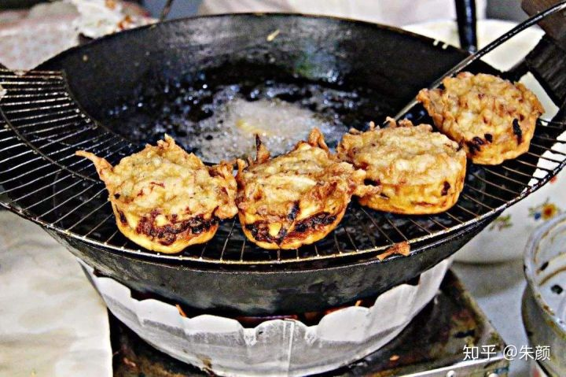

[上海油墩子怎么没以前好吃了？www.sohu.com](https://link.zhihu.com/?target=http%3A//www.sohu.com/a/224461577_247160)

我看了下做法，这个其实就是我老家的萝卜丝饼，长相也类似。

而我老家的油墩是这样的，有肉馅和豆沙馅两种

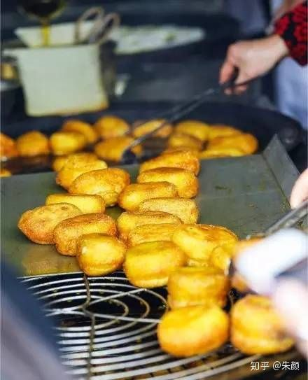

[土產研究所 | 苏州吴江冯记油墩www.sohu.com](https://link.zhihu.com/?target=http%3A//www.sohu.com/a/125871494_169200)

再是绿豆汤，我在上海喝到的绿豆汤是这样的：

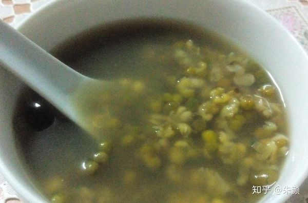

我老家的绿豆汤是这样的：

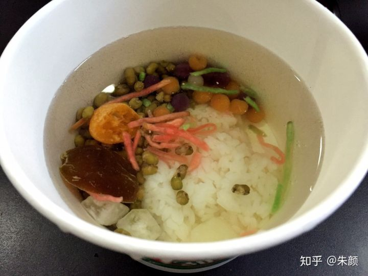

[【饭婆说】吴江绿豆汤不完全指南www.sohu.com](https://link.zhihu.com/?target=https%3A//www.sohu.com/a/110545258_349667)

39 工厂

上海制造业的大工厂：达丰和昌硕。吸纳了大量的外来人口。达丰位于松江进出口加工区（在车墩镇）。昌硕位于浦东康桥（康新公路地铁站）。一东一西都是相当偏远的地方。在市区工作的白领不会知道在遥远的松江和浦东深处，还有那么多从事劳动密集性的年轻人。昌硕距离迪斯尼乐园直线只有五公里距离，地铁只需要1站就到。不知道那些年轻人是否有钱有闲去旁白的迪斯尼玩一圈呢？见此文。

[ 离上海迪士尼仅五公里的地方，居然有一家 iPhone 超级代工厂（不是富士康）-ZAKER新闻www.myzaker.com](https://link.zhihu.com/?target=http%3A//www.myzaker.com/article/5b3145af5d8b54120b47dead/)

40 外卖

如果不出去吃那就点外卖。上海外卖渗透率很高，白领在炎热夏季中饭更爱点外卖。外卖一般就是美团和饿了么。另外还有点水果的，有专门的每日优鲜、U掌柜、小象生鲜、河马鲜生。另外外卖还有下午茶，一点点、都可等品牌。咖啡会点最近很火的瑞幸咖啡。外卖多吃会长胖。虹梅路上山寨的鹿角寨。

有的店有自己的专职配送员，例如开封菜、金拱门、达美乐披萨。

41 路边小摊

​     漕河泾开发区有推着车卖水果的，随着时节不错，贩卖的也不同，分别有青枣、莲蓬、桃子、糖炒栗子。有卖鲜花的。有躲在去远中产业园的小路上卖炒饭炒米粉的，散步经过时可香了。上海火车站的广场上有卖玉米，卖手抓饼的。上文第35条提到的各种小吃店，在早上则临时经营各种早点，有卖粢饭团的，有卖煎饼果子的，有卖韭菜盒子的，有卖手抓饼的。

42 相约星期六及其他综艺节目

   老家在苏州，在家能看到很多上海电视台的节目。印象比较深刻的，有相约星期六，媒体大搜索、舞林大会、老娘舅等。相约星期六，在非诚勿扰火爆之前，就是一档深耕婚恋很久的节目了。男主持经常换，但女主持必定是铁打的倪琳。相约星期六，真是一款男女嘉宾很真诚的节目。一般都是上海本地的白领，奔着结婚的目的而来。“相约星期六，有情就牵手”。互动的环节其实也蛮温馨的。自从离家去南京上大学，已经很久没看这节目了。老娘舅这节目则是各种家长里短，鸡毛蒜皮的事情，大部分都是为了房子。不得不说大部分上海人的居住条件真的蛮严峻。

想起来，还有愤怒主播万峰老师，最早是主持深夜情感频道，经常在直播里痛骂渣男渣女。

43 国家会展中心

因为看演唱会，去了徐泾东那边的国家会展中心。真的是十分的大。演唱会是在EH馆，又被称为虹馆。虹馆在3楼，占地面积十分巨大。饮料和食物都是无法带入的。对面的楼的4楼是美食广场，里面的美食都卖的十分贵。一个雪菜肉丝面套餐（除了雪菜面，还有一笼汤包），需要35元。面条的味道只能说凑合。虹馆进去分内场、看台。整个演唱会看下来，灯光音响偏粗犷。部分观众也不是按照座位号坐。散场后，大部分人都去徐泾东坐地铁，人流十分大。其实旁边还有个17号线的诸光路地铁站，一站也能到虹桥。

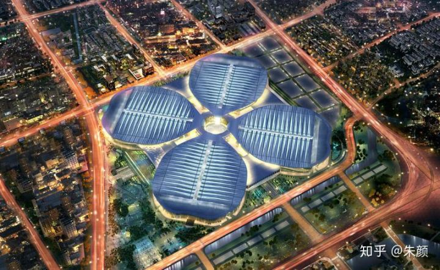

44 锅盔/烧饼

来上海前没吃过这玩意。最近迷上阿甘锅盔、缙云烧饼。只要每次在商场遇到，就必定会去吃。有多种口味，其中以梅菜扣肉风味最佳。不过价格也比较昂贵，要将近10元一个。缙云烧饼，价格便宜不少。

45 电影院

上海电影院极多。高档商场的顶楼一般都会是个电影院。我去过的电影院，虹口海宁路四川北路路口的星美国际影城，普陀祁连山路附近的沪西电影院，虹口国际客运中心旁边的白玉兰影城，普陀兰溪路上的曹杨影城。浦东长泰广场里的中影国际影城。另外普陀真北路金沙江路路口有三个电影院，分别是巴黎春天的德信影城，近铁城市广场的成龙影院，绿洲广场的金逸国际影城。电影，找豆瓣上评分高的去看。

46 百乐门及酒吧

百乐门在静安寺对面。是上海著名的舞厅。二楼是一个酒吧，叫百乐门live。酒品都比较贵。然后有唱歌演出，请的是著名歌手的御用助唱，某某歌唱比赛的第几名。里面装修的很高级。二楼两侧是敞开式包厢，每个包厢上都有电视屏，方便观看演出。在长宁定西路武夷路那有个梦在大上海，以前老是经过，查了下原来是家ktv

先前还去过黄浦区福州路的酒吧，不过就是喝酒玩飞镖之类的。外国人还蛮多的。

47 展览

上海展览很多，但需要注意甄别那些比较坑的展览。有的很明显是坑一波钱就走的感觉（主打情侣款的那种）。在黄浦中山南路往南走，滨江那边有一个展览馆。宝山有个玻璃博物馆。上海奇奇怪怪的博物馆还是蛮多的。曲阜路的大悦城老是搞些奇奇怪怪的主题展览

48 古镇老街

上海古镇老街都是商业化极强的。七宝老街、南翔老街都是各种小吃摊，嘉定镇的州桥老街。还有安亭老街，小小的一条路，就绕着一个塔。朱家角古镇比较大，放生桥连接起镇南北。古镇还有的枫泾古镇、金泽古镇等，都是开发比较小的。

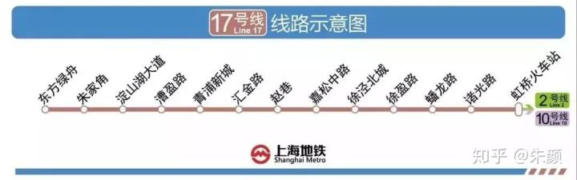

49 地铁中的扫码创业

地铁中经常有美女，打开手机微信，希望你扫码。说是在创业。有时还会送你小礼物。曾经加过两位，之后看到的朋友圈就是刷屏的奶昔广告，说是喝了可以减肥的。还po出各种喝奶昔减肥成功的案例。但不明的二维码还是少扫为妙。

有一条，不知道放哪比较好。就写这吧。在虹足看到过找工作的招聘会，大多数岗位是招聘销售。里面的薪资条件写的很夸张，月薪的跨度从3千到3万，上不封顶。

50 棚户区

上海有高楼大厦，自然也有低矮的棚户区。棚户区集中在市区。坐地铁三四号线从宝山路到火车站这一段，能看到很多低矮破旧的房子。宝山路地铁站旁边的王家宅路上也是破房子。最早来上海住在海伦西路上的一个棚户区里，房子只有5层，并不是整齐划一的小区，而就是某某里命名的。然而这个棚户区紧邻着虹口的多伦路文化步行街，两边差别很大。上海就是这样，棚户区和高楼大厦完全没有过渡，就直接展示在那。所谓的上海折叠吧。听说上海最大的棚户区在邮电新村那边，没实地去走过。

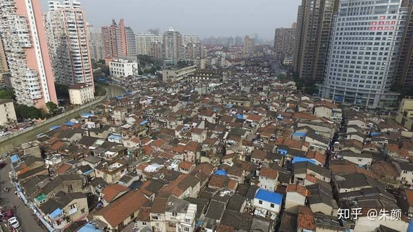

另外如果在繁华的南京西路仔细观察，可以看到由黑色铁门分隔的某某坊，某某弄小区。从外面看，这些房子和咫尺之外的繁华并不匹配。

51 引凤筑巢，筑巢引凤。上海女子图鉴

上海女子图鉴是一部挺好的网剧，比北京女子图鉴要好看。筑巢引凤是所谓的男人要在上海买房才能找到女友。然后女主说应该引凤筑巢，是女子可以不依附男人，在上海就可以立足。十分的理想化。最近的北上广深的房租暴涨，让人不禁感叹，不仅是买不起，更可能是租不起了。

有哪些事情，你去了上海才知道？ - 朱颜的回答 - 知乎
https://www.zhihu.com/question/287833567/answer/478413602