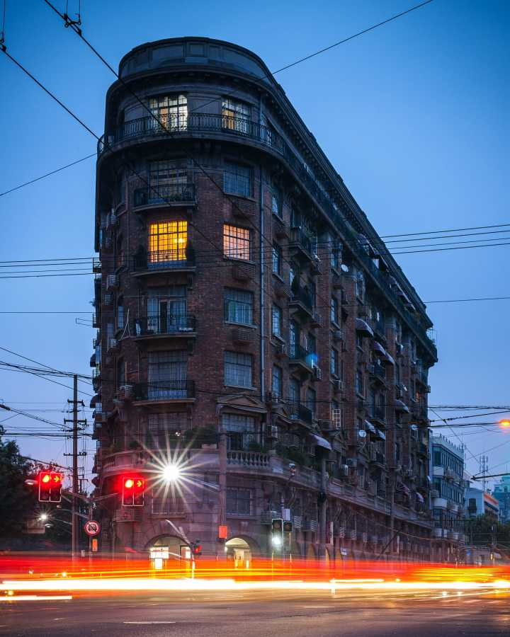
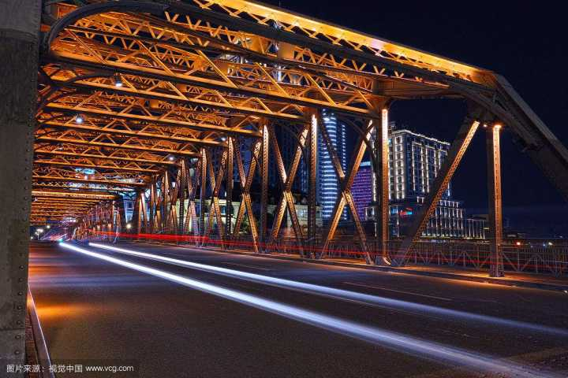

有哪些事情，你去了上海才知道？ - 悦然的回答 - 知乎
https://www.zhihu.com/question/287833567/answer/459109643

作者：悦然

21、地铁上海图书馆站附近的武康大楼个人觉得是应该去打卡的地方。

22、武康大楼也有个浪漫的名字叫诺曼底公寓，也是很多影视剧出现的地方（周冬雨的《喜欢你》）大楼左侧的路上有个街道建筑展览馆，里面就有武康大楼的模型（建议去看看）这条路再往前可以去巴金先生的故居。图中大楼右侧是宋庆龄旧居（故居？）右侧的路再向前是上海图书馆。23、秋天的时候，可以骑着小黄车以武康大楼为起点随便选条路安静的去感受一切，这里每个房子都有故事，每条路都有一个曾经。街边有很多个人艺术中心，艺术品商店，有趣的咖啡店。24、南京路在老上海人口中叫大马路，原本只是海关大楼旁边的土路，因为英国人经常会在这遛马，这也是中国马路一词的起源，中国第一个电灯，第一个电话等，也都是从南京路开始的。25、外白渡桥也是看浦东夜景的好去处，苏州河和浦江的交汇处水面开阔，倒映着这座城市繁华的虚影。外白渡桥名字也没有想象的那么诗意，就是免费的桥的大意。

26、白渡桥下的苏州河以前叫吴淞江，英国人发现走吴淞江可以到达苏州，大批量的丝绸通过苏州河运到上海转而走向世界，所以上海有今天光芒是和苏州河还有苏州是脱不了关系的。27、最近出门坐火车发现虹桥火车站候车厅内就有取票、改签、退票、售票区，根本不用跑来跑去，这比起其他车站不知道提升多少效率。～～～～～～～～～～～以前答案～～～～～～～～1、上海市区跨过浦江的几乎所有隧道和桥都不过行人的。2、上海给我最大的感受就是公共空间的建设，每个街道和社区都有图书馆放映厅小剧院之类的设施，一卡通在哪借书到哪都可以还，真的会定期有社区活动社区电影放映。3、交通管制很严格，包括非机动车辆，上海的交警应该很辛苦很晚都在外面执勤。4、因为踩踏事件后，上海的每当节假日，各个景区都会有管制，武警和消防都在景点轮番待命。（元宵节在豫园）5、很多上海本地人也适应不了快速上涨的房价，很多老上海人被迫去周边买房。6、上海的市中心逐渐会被能力强的精英占领，能力弱的上海人也逐渐被迫去了郊区。7、上海虽然是大城市但是很多时候天是真的很蓝。8、市区没有什么真的大景点，但是很多地方会去了还想去。9、上海的展馆和博物馆很多，还有一些大的商场都会布展，所以每周你都不愁没有打卡的地方。10、上海是个你在这里不会无聊的城市，很多趣店，很多地方因四季变化而转变。11、上海除了佘山没什么山。12、想看大海，想去小岛（嵊泗），想看大江大河，想去看古镇，想去湖景风光，想去郊野农巷，城市夜景，森林风光，上海都能满足。13、上海的郊区也很发达，一片农田过后可能会是一家星巴克，一条河汊之前也许是家屈成氏。14、是否真的没有什么火爆的美食街？昌里路历程路准备拆了！云南路再去的时候已经有好多店关了。15、觉得南浦大桥上的夜景是上海最美的夜景。16、上海是表面看起来浮躁，但是细细品味会回味的地方，上海是你爱上却不敢爱一辈子的地方。～～～～～～没事更点～～～～～～～～～～～～～～～17、作为平民消费上海的物价也没想象的那么高，早饭，去米其林大壶春不到16块吃饱，午饭去 兰州沙县，也就20上下。周末约人去辛香汇，2～3人也就200左右，上上谦挺好吃的而且也很实惠。18、去了上海看到有些店铺在排队不要以为是什么不得了的东西，总觉的上海人很爱排队，逢年过节南京路很多店是真的排了很多人。19、早上的南京路是被晨练的人占领的，晚上的时候以前会有很多街头艺人现在都被清退了，到了下半夜是流浪汉的天下。20、在对的季节早上去南京路可以看到很多蜻蜓。