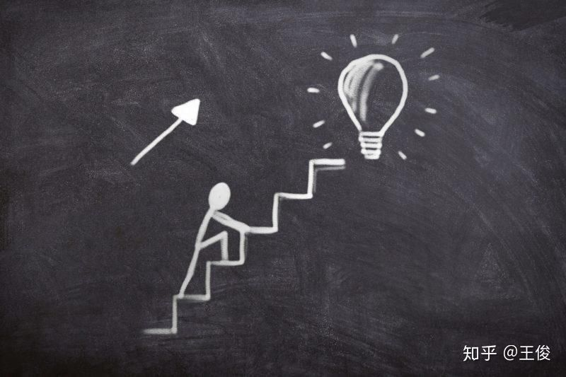

# （8300字）100岁也能快速学好英语！大脑科学的根据和适合成人的学习法、

人的短期记忆、瞬间记忆能力会随着年龄增长逐渐低下，但是记忆力本身会随着年龄增长而获得提升。

所以成人的学习，100岁也能学好，这是大脑科学（神经科学）的研究结论。

前几天看新闻，中国的一个80几岁的老人考上了研究生无疑是对此最好的说明。

但是，年龄确实会带来大脑性质的变化。

比如学习英语，成人有适合成人的英语学习方法，绝不是和学生一样的方法，因为成人的大脑需要的是“温柔”的“自动化”的学习习惯。

## 1、记忆力是随着年龄的增长而增长的。

大脑科学的研究显示，神经回路的数量会随着年龄而增加。

增加的意思指的是记忆的容量会增加，而记忆容量的变大表明岁数不是问题，年龄再打也能学好英语。

## 2、成人自感记忆力变得不好的原因是“好奇心”低下造成的。

随着年龄的增长而感觉自己记忆力下降，是经验的惰性越发“占坑”思维，对什么都提不起兴趣的原因，“好奇心”，“探究心”的“变薄”造成了这种感觉，但事实根本不是。

合理的大脑，甚至对自己不感兴趣的物事都不能简单记忆。

如果自己想学英语，但是对英语本身并没有感觉有意思，那么通过选择自己感兴趣的题材、教材来学习是能成为一个比较好的开始的。

## 3、成人不可能像学生、孩子一样学得英语！

所有的孩子都是语学的天才，他们会模仿，会重复模仿，不厌其烦。

但是成人不行，大脑的性质不一样，但是成人有适合自己的学习英语的方法。

孩子擅长“死记硬背”，对于无意思的数字、单词等尤其得意，当然语法等规则也能简单记住。

但是这种“死记硬背”的能力会随着年龄的增长而衰弱（15、16岁是界限）。

相反，过了这个时间界限的记忆会逐步向理解后记忆的方向发展，所以，成人想要和孩子一样靠“死记”来完善学习英语的过程，效果几乎可以想定。

另外，如果成人不知道这个大脑性质变化的事实，那么随着自己年龄的增长就会产生“记不住”的错觉。

## 4、成人的大脑不喜欢的英语学习法是这个！

### **1）成人学习英语时，必须要学习语法吗？**

孩子即使不学语法也能学得英语（所以幼小的孩子学英语时不要把语法学习当成一门课来让他们单独学习），但是成人必须学习语法。

### **2）英语中出现的固定表现等的死记硬背不可取。**

我喜欢【语法俱乐部】这本语法书的一大原因就是它会让你忘记大多数（包括学校的英语教学）语法书中涉及到的生硬的固定的所谓的语法规则，而会告诉你看这些内容要像看小说一样地去这样简单认识就可以，已是拆解到傻子都能明白的地步。

死记固定表现等的记忆方法对成人的大脑并不适合，而且这样的学习法自身也不科学（学校英语教学专注教语法100年问题大大）。

如上所述，成人的大脑不擅长死记硬背（除非一些非得死记硬背的基础知识，但也不能一门心思死记，而是要通过“触及效应”，短时间反复，高频词接触才能获得更好的记忆效果）。

只要不反复去复习，死记硬背记下的内容很容易就会忘记，像很多人去上英会话学校，但是英语就是不长进也是这个原因。

另外，第二言语学习的各种研究也早已之处，语法学习，记住英语中出现的固定表现，句型、语法知识本身是学不好英语的。

学习语言必定是发音+单词+语法的组合才能有可能的无限创作，而固定表现等即使都记住了也无法让你流畅地说英语。

### **3）多听意思不理解的英语音频几乎没用。**

我在前几天的文章中说明了幼小孩子学英语的方法，必须是从培养孩子的“节拍回路”，通过多听，每天听来为孩子创造第二言语的语境开始，然后父母不能用中文，而是直接用图片、行为等来让孩子知道英语代表的是什么。

本来孩子学习母语时也是通过这种方式来学到的。

因为孩子在学得语言的过程中，最初只是捐单地听父母说得话，做的行动，意思不明也在听。

只是这期间的孩子的大脑的对语言和对周围认识的吸收程度处于高度发达的途中，就像黑洞一样，只要在周围出现的，他们都能吸收和记住，但是成人的大脑已经没有了这样的效果。

所以，即使反复听反复听，只要意思不理解，这样的学习方法对于已经习惯于母语语境的成人来说等同于无用。

## **5、成人的英语学习必须是“理解”、“记忆”、“自动化”。**

适合成人大脑性质的学习法，首先必须是理解，记住这些道理，然后把学到的知识的反复应用来真正掌握—要让自己变成无需注意和意识，也能自动活用的过程。

在第二语言学习的研究中，这就是被称为“自动化学习”。

### **1）孩子的“意思记忆”和成人的“情景记忆”。**

孩子擅长“死记硬背”的原因在于“意思记忆”的发达，成人的记忆方式，比起“意思记忆”的减弱，“情景记忆”的能力更发达。

人的记忆大的方面可分为“长期记忆”和“短期记忆”，而和语言学习有着深度关联的长期记忆更是被分成了4种，其中“意思记忆”是对无意义内容的“死记”，而“情景记忆”是依于已有道理、知识、经验等之上相互关联，联想等增加想起线索的记忆。

孩子时期“情景记忆”不发达，因为孩子还在接触社会，学习知识和经验的途中，所以“意思记忆”极其发达，反正什么都能装，能发挥出绝大的效力，但是随着年龄的增加，这种能力会慢慢低下，相反，“情景记忆”能力会开始提升，逻辑的记忆力开始被大幅度应用起来。

### **2）成人学习时要求的“自动化”=大脑可续研究上的“手续记忆化”。**

不管是意思记忆还是情景记忆，记忆本身都被大脑保管着，为了能让这些记忆在要被用到的时候会被无意识地被抽出使用，这就有必要有一个“手续记忆化”，在科学上这被称为“自动化”。

手续记忆本身也是记忆的一种，属于简单类型的记忆，比如学会骑自行车，记住游泳的方法，用母语说话等的记忆，所谓的身体记忆，一旦形成很难忘记。

“手续记忆化”，也就是“自动化”有大脑反复进行的要求，也就是说，为了能自由使用也英语，总之反复+反复是最重要的。

## 6、成人的依据大脑科学的英语学习方法。

成人的学习方法，需要“温柔”和“效率”。

### 1）成人的英语单词记忆方法。

#### *** 成人记单词，比起看记，听记更容易在大脑中留存印象—耳朵记忆的效果>眼睛记忆的效果。**

在大多数动物的进化过程中，比起眼睛，耳朵的活用更彻底，就像耳朵不好（听力不好）的人，语言的学习和发展都会相对迟缓就是最好的证据。

所以，不光是英语学习，即使其他学习，用好音频，用听学的方式都会获得高效率（就像我在之前的文章和想法中多次介绍的录音学习法，要多用）。

不看书，边听音频边想起意思或者拼写等，从大脑科学的视点出发是符合道理的英语单词记忆方法，尤其是对成人的英语学习。

另外就是反复接触，每次不求能记住，就是看过掠过就好，关键次就是高频次+短时间接触。

#### *** 通过例文来记单词。**

英语单词放在文脉中记会很有效率。

成人的大脑对于物事之间附加关联（关系，线索）的记忆更容易记，而且能同时起到刺激神经回路的作用，对于活性化大脑和提升记忆力都有效。

其中，意识着“语源”来记单词，也是给单词附加关联的一种手段。

#### *** 多读和narrow reading（窄式阅读）**

比起自己现有水平的英语力，若干稍微难一点的英语读物的阅读和多读，是效率提升单词力的有效方法之一。

以往的科学试验也确证了，阅读比实力稍高难度的教材，大脑的血流状态会接近于摄取新知识最效率的状态（科学上成为“选择的活性状态”）。

另外，习得者在较窄的主题范围，相同主题范围或者文体的材料中大量集中的阅读输入，并逐步扩大主题范围的narrow reading，语言习得会进展得更快，而且大脑内的选择的活性状态有效果。

#### *** 学到的英语单词要多用，多积极想起、活用和测试。**

比如我前几天的文章中介绍的，每晚睡前用英语写简单格式的5行日记等。

我们的大脑具有，“比起只看只听的输入，把看到的听到了无数次想起和使用的输出的长期安定保持情报”的特质。

不管什么学习，输出都是本质的方法。

### 2）成人的英语语法的学习方法。

##### *** 成人的语法学习，必须建立在理解透彻的基础上。**

首先要理解语法项目，因为成人的大脑擅长的就是记忆理解后的理论和道理，而且一旦记住了就较难忘记。

死记的效率不好，不管什么乱七八糟的屁道理都可以+和什么关联起来记的效果才会好。

##### *** 语法的学习也需要熟读+记忆例文。**

和记单词同样，语法也可以通过例文同时记。

例文中的单词的意思和语法项目关联起来的记忆（其实就是熟读+想象例文的意思），能起到同时记住单词和语法的高效和效果。

##### *** 语法也可以听学记住。**

和单词同样，语法也可以听学记。

多听几遍例文的音频，要边意识着语法构造和意思边听，也要逐个理解，听完后大声音读多遍。

模仿音频自己发音也是在听自己的声音，是很有效率的学习。

##### *** 语法的学习，从基础的大局理解然后逐步详细。**

语法学习的基本是先看一通，然后第二遍阅读时进入细节阅读。

马上从头到尾地细致阅读或者从难点开始阅读，对于成人的大脑来说绝对是非效率的做法（这也是成人在做任何阅读时，必须先要快速浏览一遍抓全貌，想目标，了解文章意图，发现重点后再进行第二遍细致阅读的原因）。

在要掌握任何知识的时候，都先要从大局的理解开始，详细的地方在一点一点去理解去记才是高效学的阅读方法。

##### *** 语法也要多读和narrow reading（窄式阅读）**

也和学习单词同样，要通过多读和窄式阅读比自己水平稍高的英语读物来熟练和掌握语法。

把语法项目放在文脉中记，对于新的构文和语法项目的习得会有很好的效果。

##### *** 语法的学习一样需要自己去多用，去测试去想起。**

写写日记， 自己用学习的语法造句，写文章等。

或者做语法练习，解答问题也能起到相当好的效果。

输出一定要多做，而且要同样内容的反复做才能保持长期安定的记忆。

### 3）成人的英语发音的学习方法

##### *** 发音校正从动作的理解开始。**

英语的发音，首先要从动嘴的方法的理解开始。

为了正确地进行英语的发音，喉·舌·唇·颚·肺必须有正确的动作。

理解这些部位是如何动起来的道理，是掌握英语发音的第一阶段。

比如L和R的发言区别等，总之英语母音和字音很多，省略发音等多发，要注意。

##### *** 发音校正和提升听力要克服运动能力。**

重复模仿英语的发音，不只是自己能正确发音， 对于提升听力也极具效果。

发音是运动系的能力，运动系的能力是不管多少岁，只要训练了就能适应的能力，这是大脑科学的研究结论。

所以，最初没有意识着英语的发音动作，英语的发音会觉着比较难。

但是，如果意识着英语发音，然后无数次反复模仿再自己发音确认，渐渐就会变得无需意识也能正确做到。

发音校正的过程，同时也是提升听力的过程。

自己发音不能或者发音不正确的音是听不进耳朵的，因为大脑不能认识音色的缘故。

所以，为了练好发音，除了意识发音动作之外，多听多模仿多跟读多音读是唯一的有效方法。

## 7、让成人的英语应用“自动化”的方法。

上述3点是成人学习英语时的基础知识，掌握到一定程度后，接下去要做的就是如何让这3点能“自动化”的训练。

简单来说，英语的自动化就是为了获得英语脑（英语回路）而需要的训练。

从成人学习英语的视点出发，最初肯定是掌握一定量的单词，与此并行的是同时要正确掌握发音（多练习）。

单词的排列方法就是语法的问题。

总之，要学好英语，必须先从这3点入手，然后才是如何活用·使用的事。

这个如何活用·使用就是如何让这些基本元素组合起来加以反复训练，最后达到能“自动化”运用的过程。

### **1）为了获得自动化应用效果的主要训练方式。**

大脑科学把“自动化”称为“情景记忆”，或者是“意思记忆的手续记忆化”。

这个手续记忆化中，大脑要求的是反复。

总之，无数遍的反复是大脑科学认知中最重要的一件事。

人在阅读、听解、写文、说话的时候，大脑同时会进行8个处理，为了能让英语的4技能流畅地提升，一定要通过不断地反复，让这8个处理可以在无意识中快速、自动地进行，即达到自动化的目的。

而能让这8个处理自动化进行的代表性的训练方法有22个，其中最重要的就是一下的8个，注意进行说明。

*** 音读的方法和效果**

音读，简单来说，就是读出声来，不管是大声还是小声，甚至是轻声，也就是说边看英语内容，边理解意思（内容）和语法（文的构造或者构文等），同时读出声来。

英语内容的反复音读，可以促进以下内容的自动化：1）加深对单词的理解，特别是音色和文字、意思的结合理解，2）读的内容的单词、构文或者语法构造等的解析和理解，知识的无意识使用，3）正确的发音，抑扬顿挫、强弱、节奏、变化等，自然的英语表现的运用，4）英语的听力和理解能力的UP，阅读英语文章的速度提升。

音读根据目的不同可分为3种类：意识着意思的音读—内容音读，意识着发音的音读—音色音读， 意识着表现的音读—表现音读。

内容音读可带来3效果：1）看文字理解意思的能力UP，2）听音色理解意思的能力UP，3）用英语理解英语的语顺理解能力的UP。

音色音读是主要为了掌握正确发音等的音读，所以完全模仿音频是练习的基本，反而不要太在意意思和表现等。音色音读可带来的3效果：1）文字的发音方法的深化理解，2）能做到无意识中让母语者也能快速理解的发音和说话，3）掌握英语独特的韵律、节奏等，听取英语会变得容易起来。

表现音读，顾名思义，意识着表现的同时，为了以记住自己使用时如何表现和表达的目的的音读。表现音读的勤练习可以做到运用英语时的自然表现，当然也能提升英语的听力和表达能力。

*** 背诵的方法和效果**

背诵是理解英语文章的意思和语法的同时，通过有音读、默读、记忆后，不看英文也能想起并发声说出来。

记熟后的反复背诵，能促进1）一看单词就能理解，2）解析文章的构文和语法构造，加深理解，3）听力的UP，英语对话应用的自动化。

*** 默写的方法和效果**

默写是指理解英文文章中的内容后，音读默读等记忆后，不看英文也能写出英文内容。

效果同背诵。

*** 自翻译的方法和效果**

自翻译指的是在理解课文内容后，看着英文翻译成中文，看着中文翻译成英文。

自翻译是熟悉和掌握英语课文内容与否的标杆，熟练后音读、背诵和默写等都能手到擒来。

最主要的效果是输出效应，在还没有背诵和默写的前提下的自翻译，能有效纠正自己的理解和单词、语法的错误。

*** 听写的方法和效果**

听写指的是边听英语文章的音频，在理解意思和语法的同时，把听到的内容写出来。

效果同背诵。

**注：**背诵、默写、听写等都是在阅读英文或者听了英文音频后写出、说出的作业，需要一些时间来完成。

为此，在一定程度上有必要记住长文。

记忆长文的时候首先必须先理解文的意思和语法构造，否则再怎么做都是枉然。

但是很多时候，我们并没有太多把英文变换成中文后花时间仔细理解的时间，所以，英语用英语来理解，不要硬性翻译成中文去理解，以及用英语的语顺来理解，熟练后很能促进自动化的形成。

*** 跟读的方法和效果**

跟读原本是同声翻译者们的练习方法，但是对英语学习意义重大。

跟读指的是听完一段音频，少延迟的情况下马上模仿读的方法，这个情况下也可以只是为了练发音和跟进，不一定要在理解的基础上才能练习。

跟读主要练习的是发音，分为看着文章和不看文章的两种形式，最终是不看文章也能在几秒钟内跟上音频的速度，尽量达到和音频一致的发音。

跟读是英语学习最重要的方法之一，对于促进听取单词、句子的发音，理解意思和理解文章非常实效。

跟读是听到后马上出声模仿，所以更能强化语言发音的正确性和对文章的理解能力。

\* 瞬间英语作文的方法和效果

瞬间英语作文是指听到、看到的中文意思马上在脑中翻译成英文（想着用英语怎么说）。

比如看电视看文章等时，时不时想着这句话用英语怎么说，在心中说一说，然后在这种意识加持下的反复练习，对于英语运用的瞬间反应能力会有相当大的提升，但是对于英语用英语来理解和使用的能力帮助不大。

所以学习英语时的最重要事是尽量不要养成用中文介入的习惯，特别是中级学习以上的学习者。

### 2）达到自动化的训练也需要“多读”和**narrow reading（窄式阅读）。**

要达到语法应用的自动化，和单词一样，多读和窄式阅读也是有效的训练。

用英语来理解英语，用英语的语顺序来组织英语，可以有效促进语法应用的自动化。

## 8、理解成人大脑的更多特质后，效率进而会得到提高！

理解成人的大脑特质，可以让英语的学习会更有效率。

而其中最主要的就是要聚焦在学习习惯上，即养成学习英语的各种习惯。

### 1）习惯1：睡觉期间，大脑的有效活用！

我们知道，人的大脑在睡觉期间也是在运转着，在整理一天的记忆。

也因为大脑这个整理整顿的行为，很多时候我们在学习时不能理解的知识点，在睡觉起来后突然变得能理解了。

大脑可续的研究中，这个现象被称为“**追忆现象**”。

追忆现象是学习过的内容，岔开时间后会高度化的现象。

用在日常学习中时，与其一天6小时集中学习的效果，会远远不如每天2小时x3天学的效果。

因为期间加入了睡眠，可以进行记忆的整理，进而掌握起来更效率。

英语学习也同样，每天一点尧积累的学习的方式具有压倒性的效率。

### 2）习惯2：每天6小时以上的睡眠和固定睡眠早起时间！

你一定要把睡眠当成学习的一部分来考虑。

为了效率地记忆，学习当日（也就是每天），你必须睡足至少6小时。

美国哈佛大学的精神医学家的罗伯特·斯迪克哥顿发表在2000年的认知科学杂志上的研究结果表明，在学习新知识掌握新技能的时候，学习当日6小时以上的睡眠是不可缺的，而不睡或者书面不足硬塞进大脑的记忆，不会被“刻入”侧头叶，数日之间就会小时，就像考试前的通宵学习，考完试就会马上消失一样的情况。

### 3）习惯3：睡前15分钟~30分钟是记忆的最高黄金时段！

真能记住的话，睡前15分钟~30分钟用来记忆是最好的，因为这是任何人、一天中最高效的记忆黄金时段。

当然，如果能在早起后再加上一遍同内容的确认、整理、熟考，那么记忆效率会轻松提升70%以上。

尤其适合单词和当日所学要点的记忆。

### 4）习惯4：固定时间学！

不能坚持学的动力不能依靠主观意志，最大的诀窍在时间·计划管理上。

特别是固定一天中可固定的时间学习固定的内容，养成习惯，把一天的学习时间结构化。

比如上述的睡前背单词，不同碎片时间学习什么的固定，还有一放学后马上回家做什么等。

这不但能解决持续学习困难的问题，养成习惯后，学习无需意识也能自主进行。

### 5）习惯5：1个月内不复习几乎等同于白学！

1个月以内不向“海马体”反复传递几次学习过的内容，几乎所有的记忆都会被消除。

大脑中记忆的一时保管场所是“海马体”，最长也就能维持几天的记忆，所以必须要在“海马体”还保管的时间内多“送信”几次，让海马体认知到这些内容是必须要记住的，记忆才能从“海马体”被移动到长期记忆的保管场所的新皮质·侧头叶。

### 6）习惯6：2个月内最少3次的复习！ 

科学上最有效率的复习时机，除了当日·第一次复习的时机非常重要外，从翌日开始最少雅瑶做到1周内1次，2周后第2次，1个月后第3次，即1次的学习和至少3次的复习，在2个月内，逐渐拉开间距实行。

实在不能计算复习的时机，可简单参照遗忘曲线进行，或者学习翌日开始到考试日之间的天数除以5，分成5次来复习即可。

### 7）习惯7：用教授他人的感觉自我说明，变成情景记忆！

记住的内容对人对己说明时，你必须要真正理解和记住，还要进行自我整理和加工，所以记住了就很难忘，而且想起也会变得更容易。

能说明是因为你已经把“意思记忆”变成了“情景记忆”。

而“情景记忆”最大的作用是关联，其实就是在构建和增加对学习内容的新的神经回路，能给要记住的知识点附加以往经验和关联，也就是在增加更多想起的线索。

当然如果限于条件不能向他人说明或者自我说明时，不看书的想起后的汇总要约，用导图和图示等来表示，或者发信到博客等之上，效果也同样好。

### 8）习惯8：从基础到应用，从大局到细部的顺序！

总之，英语学习的初期阶段最难，大脑要构建神经回路，而且成果很难马上获得反馈，所以最初阶段的努力、坚持、不气馁最重要。

另外努力和成果不是比例关系，而是倍乘关系—比如学习的目标是1000时，学习开始的时间点是1，越是坚持的效果，越会如2、4、8、16、32、64、128、256、512，直至最后的1024，这样的成长感觉才是大脑所具有的特质。

## 9、最后

把关于成人如何学好英语的上述内容汇总一下。

\* 神经回路的数量随着岁数的增加而增加，所以用成人特有的记忆方式，即使上了岁数也能快速学好英语。年龄大了感觉记忆力低下的真正原因是“好奇心没了，思考的模式定型化”的缘故。

\* 成人模仿孩子的方式学习英语，肯定是低效率的，因为大脑的性质不一样。成人要用适合成人大脑的英语学习方法。

\* 适合成人的大脑的英语学习方法是“理解”后，记忆这个道理，然后把掌握的知识反复地运用，活用各种方法来达到“自动化”。

\* 成人的大脑能简单记住英语单词的方法，1）比起看记，要多用听记，2）通过例文记，3）多读和窄式阅读，4）多用。

\* 成人的大脑能简单学会的英语语法的方法，1）首先要仔细理解，2）通过例文来记，3）听记，4）理解大局后再到详细，5）多读和窄式阅读，6）多用和活用。

\* 成人的大脑适合的英语发音学习，首先要理解喉、舌、唇、颚和肺的动作，然后尽量模仿到接近。掌握了发音，听力也会大涨。

\* 为了能让单词、语法、发音的3重点能无意识地自动化，大脑要求必须通过反复再反复来达到无意识也能自动对应的程度。

\* 多了解一点成人大脑的性质后再学习英语，效率会提升更快，特别是要养成睡眠中活用大脑学习的习惯，还有就是学习初期最重要，而且对于任何人都是很困难的，所以如何坚持，如通过固定化时间和内容，把学习流程结构化等方式来让自己持续下去，要做好心理准备。

—END—

发布于 2020-05-19