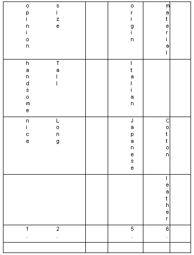

**Adjective Order**

When two or more adjectives are used to describe something they are  put in a certain order. For example, opinions come before facts.

- Beautiful long black hair
- A handsome young man
- A nice new shirt

Nice, beautiful and handsome are opinions. Young, new, long and black  are facts. Opinions come first. Size comes before age. Age comes before  color. The following chart show the basic order of adjectives, but you  should know that sometimes this order is not followed.

[NOTE IN THE ABOVE CHART  “shape” (round, square) should be put  between “age” and “color”, and the “noun” column should be separated  from the other columns, with a + inserted.]

 Example:
 We rented a nice little brown log cabin by a lake. 

Note: We usually limit the number of adjectives preceding a noun to three.

 [Back to Index](https://cns.ef-cdn.com/EtownResources/Grammar/EIndex.html)  

Copyright Ultralingua 2002