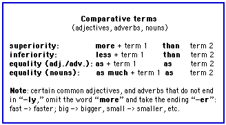

**Comparatives**

- [General principles](https://cns.ef-cdn.com/EtownResources/Grammar/36.html#generalite)
- [Adjectives](https://cns.ef-cdn.com/EtownResources/Grammar/36.html#adjectif)
- [Adverbs](https://cns.ef-cdn.com/EtownResources/Grammar/36.html#adverbe)
- [Nouns](https://cns.ef-cdn.com/EtownResources/Grammar/36.html#nom)
- [Verbs](https://cns.ef-cdn.com/EtownResources/Grammar/36.html#verbe)
- [Related topics](https://cns.ef-cdn.com/EtownResources/Grammar/36.html#related)

 

**General principles**

**Comparatives** are used to compare two things and to highlight the superiority, inferiority, or equality of one term compared to another. The comparative can apply to adjectives, adverbs, nouns, or even verbs. Whatever the part of speech concerned, the structure of the comparison remains the same:

**Examples for adjectives, adverbs, nouns, and verbs follow:**

 

**Adjectives**

Adjectival comparisons follow these models:

- Jean is taller than Catherine.
- Philippe is less tall than Jean.
- Leïla is as tall as Jean.

**Note:** Monosyllabic adjectives, and several common two-syllable adjectives, take the ending "**--er**" and do not include the adverb "**more**":

- young --> younger

- tall --> taller

- old --> older 

  If the adjective ends in "**--y**" the "**y**" becomes "**i**" :

- heavy --> heavier

- early --> earlier

- busy --> busier

- healthy --> healthier

- chilly --> chillier 

  If the adjective ends in "**--e**" only an "**r**" is needed:

- wise --> wiser

- large --> larger

- simple --> simpler

- late --> later 

  If the adjective ends with "**single vowel** + **consonant**" the consonant is doubled and one adds "**--er**" :

- red --> redder

- big --> bigger

- thin --> thinner

- hot --> hotter 

  Some very common adjectives have irregular comparatives:

- good --> better

- bad --> worse

- far --> farther

 

**Adverbs**

Adverbial comparisons follow these models:

- The students are working more diligently than the professor.
- This fellow speaks less eloquently than a schoolboy.
- They are all working as hard as possible!

**Note:** In comparisons indicating **superiority,** adverbs ending in "**--ly**" do not take the adverb "**more**," but only the ending "**--er**". (However, these adverbs will function normally in comparisons using "**less**" or "**as**.")

- fast --> faster
- hard --> harder

And some adverbs have irregular comparative forms :

- well --> better
- badly --> worse
- far --> farther

 

**Nouns** 

Noun comparisons follow these patterns:

- I have more work than you.

- He has less homework than the rest of us.

- If only I had as much talent as she! 

  The comparative can signal quantities of nouns:

- I have less than five francs in my pocket.

- She has more than five hours worth of work to do. 

  However, in comparisons of inferiority, and when the quantity represents a "countable" noun, one should use the term "**fewer**" rather than "**less**" :

- He works fewer than ten hours per week.

- Sam has fewer students than I do.

 

**Verbs**

"**More**," "**less**," and "**as**" can be used as adverbs to modify verbs:

- He eats more than he used to.
- That boy reads less than his friends.
- You ought to listen as much as you talk.

 

**Related topics**

- [Superlatives](https://cns.ef-cdn.com/EtownResources/Grammar/37.html)

[Back to Index](https://cns.ef-cdn.com/EtownResources/Grammar/EIndex.html)

Copyright Ultralingua 2002