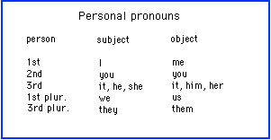
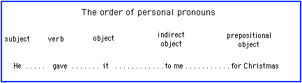

**Personal pronouns**

- [Forms](https://cns.ef-cdn.com/EtownResources/Grammar/26.html#forme)
- [Subject pronouns](https://cns.ef-cdn.com/EtownResources/Grammar/26.html#sujet)
- [Predicate pronouns](https://cns.ef-cdn.com/EtownResources/Grammar/26.html#complement)
- [Order of pronouns](https://cns.ef-cdn.com/EtownResources/Grammar/26.html#ordre)
- [Related topics](https://cns.ef-cdn.com/EtownResources/Grammar/26.html#sujets)

 

Here are the different forms for personal pronouns in English:

 **Use of the subject pronoun**

Subject pronouns reflect the nouns they replace. Since English nouns rarely show gender, the pronouns "**he**" and "**she**" are generally used only for people or animals; in the case of objects or impersonal expressions, the pronoun "**it**" will be used.

Examples:

- She wants to eat.
- You look tired.
- It is hard to cook well.

 

 **Use of predicate pronouns:**

Predicate pronouns will always have the same form whether they are used as direct, indirect, or prepositional objects. The forms are: "**me**", "**you**", "**it**", "**him**", "**her**", "**us**", "**them.**"

Whatever the form of the sentence (affirmative, negative, interrogative), direct objects -- or the pronouns replacing them -- will follow the verb:

- Did you buy it?
- You didn't buy it.
- You bought it.

Prepositional objects will come after their preposition:

- Will you come to the store with me?
- He left without her.

Indirect objects will generally come after the proposition "**to**," except if the pronoun precedes the direct object, in which cas the proposition "**to**" disappears:

- I have spoken to her.
- I gave this present to them.
- **BUT :** I gave them this present.

**Order of pronouns** 

When a verb is followed by two or more pronouns, the following sequence is observed:

Examples :

- Don't tell that to him.
- He couldn't sell the car to them.

**Exception:** As noted above, one may omit the preposition "**to**" in front of an indirect object, in which cas the indirect object pronoun precedes the direct object:

- He gave me it for Christmas.
- Don't tell him that.
- He couldn't sell them the car.

 

**Related topics**

- [Relative pronouns](https://cns.ef-cdn.com/EtownResources/Grammar/27.html)
- [Reflexive pronouns](https://cns.ef-cdn.com/EtownResources/Grammar/28.html)
- [Reciprocal pronouns](https://cns.ef-cdn.com/EtownResources/Grammar/29.html)
- [Demonstrative pronouns](https://cns.ef-cdn.com/EtownResources/Grammar/30.html)
- [Possessive pronouns](https://cns.ef-cdn.com/EtownResources/Grammar/31.html)

[Back to Index](https://cns.ef-cdn.com/EtownResources/Grammar/EIndex.html)

Copyright Ultralingua 2002