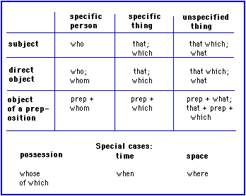

**Relative pronouns**

- [General information](https://cns.ef-cdn.com/EtownResources/Grammar/27.html#generalite)
- [Subject pronouns](https://cns.ef-cdn.com/EtownResources/Grammar/27.html#sujet)
- [Object pronouns](https://cns.ef-cdn.com/EtownResources/Grammar/27.html#objets)
- [Possession ("whose")](https://cns.ef-cdn.com/EtownResources/Grammar/27.html#possession)
- [As prepositional objects](https://cns.ef-cdn.com/EtownResources/Grammar/27.html#objet-prepositions)
- [Time](https://cns.ef-cdn.com/EtownResources/Grammar/27.html#temps)
- [Space](https://cns.ef-cdn.com/EtownResources/Grammar/27.html#espace)
- [Related topics](https://cns.ef-cdn.com/EtownResources/Grammar/27.html#sujets)

 **General information**

**Relative pronouns** are used to join two sentences. For example, the following two sentences,

- I found an apartment. This apartment has three rooms.

may be joined using a relative pronoun:

- I found an apartment which has three rooms.

Relative pronouns have many different forms: **who**, **whom**, **whose**, **that**, **which**, **that which**, **what**. The pronoun is selected based on the following criteria:

> 1) What is the grammatical 
>
> function
>
>  of the    pronoun? Is it a subject, a direct object, or a prepositional    object?        
>
> 2) Does the pronoun refer to a person or a thing    (or a situation)?
>
> 3) Does the pronoun have an antecedent, or does it represent an    unknown entity?
>
> 4) Does it represent a special case (possession, time, or    space)?

According to the role it plays, the pronoun will take one of the following forms:

 

**Subjects**

The pronoun "**who**" expresses a grammatical subject when this subject is a person; "**that**" or "**which**" are used (indifferently by most speakers) to represent subjects which are things, events, situations, etc.

- There's the man who stole my wallet!
- I read a novel that entertained me a great deal.
- He made a mistake which embarrassed him.

When the antecedent is vague or totally absent, one uses "**what**" or (less commonly) "**that which**" :

- What interests me in this film is the music.
- That which eludes us intrigues us the most.
- I don't know what happened.

 

**Objects**

The pronoun "**whom**" (in spoken language one often hears "**who**") expresses a grammatical object when this object is a person; "**that**" or "**which**" are used (indifferently by most speakers) to represent objects which are things, events, situations, etc.

- She is a person whom I respect a great deal.
- He ordered a beverage which he didn't drink.
- She is talking about the trip that we're going to take.

**Note:** Use of the relative pronoun is optional (except in the case of "**what**" or "**that which**" when referring to specific antecedents); the same sentences as above may be written correctly **without** the pronoun:

- She is a person I respect a great deal.
- He ordered a beverage he didn't drink.
- She is talking about the trip we're going to take.

When the antecedent is vague or absent, on uses "**what**" or (less often) "**that which**" :

- You can do what you want.
- What they are doing seems useful.

 

**Possession: "whose" / "of which"**

The pronoun "**whose**" expresses possession when the subject is a person; it will often be replaced by "**of which**" if it refers to an object, an event, etc.:

- The tourist whose ticket had expired filed a complaint.
- There is the man whose mother is our mayor.
- That was a good article, the point of which was to make us think.

 

**Prepositional objects**

The preposition generally precedes the appropriate pronoun:

- Here's the pattern with which I made this shirt.

- The woman for whom I work is quite strict.

- Here's the tree next to which Newton was sitting.

- They went out for dinner, 

  after which

   they went home.    

  **In spoken English**, one often places the preposition at    the end of the clause. Moreover, with the pronoun "**what**"    this structure is required, even in written English:

- Here's the pattern which I made this shirt with.

- The woman whom I work for is quite strict.

- Here's the tree which Newton was sitting next to.

- Tell me what you're thinking about.

 

**Time**

The pronoun "**when**" is used with nouns indicating time. However, it is rarely necessary to include this pronoun, and it is often omitted:

- I remember the day when we met.
- I remember the day we met.
- He arrived at the moment when we were speaking of him.
- He arrived at the moment we were speaking of him.

 

**Space**

When more specific prepositions (such as "**on**," "**under**,", etc.) are not necessary, the general pronoun "**where**" will suffice:

- Here's the house where my parents were born.
- She doesn't know where she's going.

 

**Related topics:**

- [Subject pronouns](https://cns.ef-cdn.com/EtownResources/Grammar/26.html)
- [Object pronouns](https://cns.ef-cdn.com/EtownResources/Grammar/26.html)
- [Reflexive pronouns](https://cns.ef-cdn.com/EtownResources/Grammar/28.html)
- [Reciprocal pronouns](https://cns.ef-cdn.com/EtownResources/Grammar/29.html)
- [Demonstrative pronouns](https://cns.ef-cdn.com/EtownResources/Grammar/30.html)
- [Possessive pronouns](https://cns.ef-cdn.com/EtownResources/Grammar/31.html)

 [Back to Index](https://cns.ef-cdn.com/EtownResources/Grammar/EIndex.html)

Copyright Ultralingua 2002