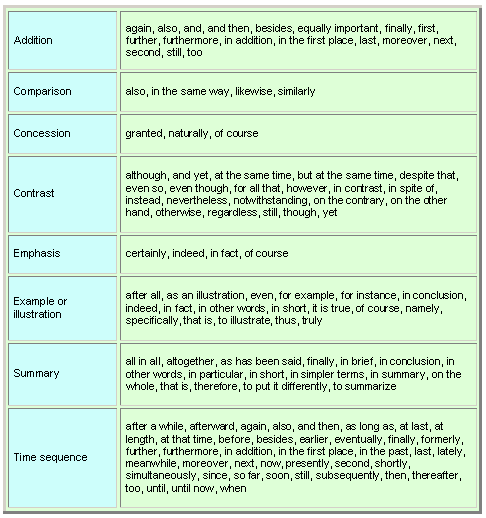

**Transition**

 A transition is a word or phrase that allows for fluid movement between  ideas, sentences, or paragraphs. A transition expression helps the  speaker or writer to construct coherent sentences. In writing, a  transition expression is typically set off with punctuation. Transitions  include but are not limited to the following kinds: comparison,  contrast, summary, and order of importance. Many common transitions are  listed in the chart below. 

 Examples: 

- We’re too tired to go jogging tonight. Besides, it’s very cold outside.
- Brittany doesn’t dance very well. On the other hand, she sings beautifully.
- Sally just got a job in San Francisco. Therefore, she won’t be moving to London. 

 [Back to Index](https://cns.ef-cdn.com/EtownResources/Grammar/EIndex.html)  

Copyright Ultralingua 2002