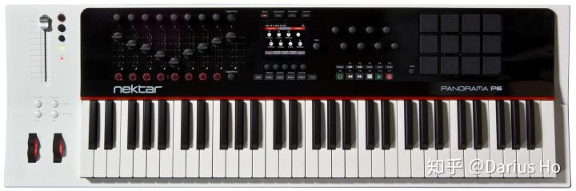
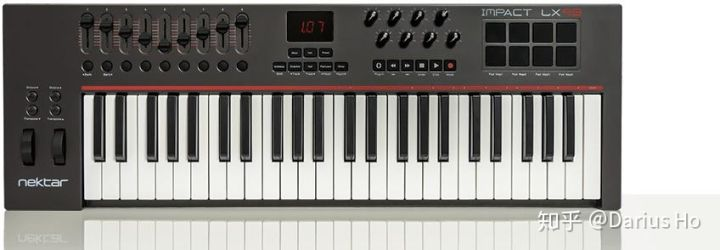
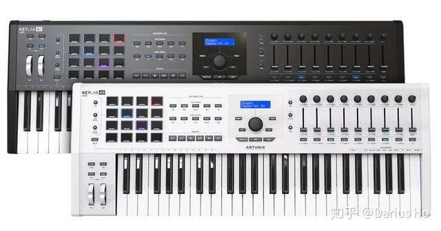
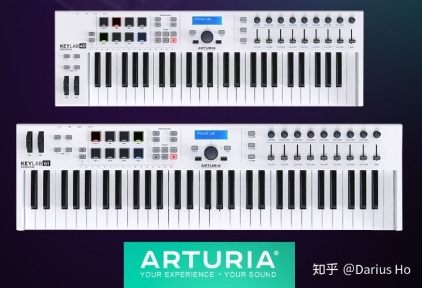

# 电音兼交响制作选用什么midi键盘合适？

鉴于我需要加强键盘熟悉程度，所以61键是我的选择，但除此以外还想问问：基础键盘能胜任吗？（窄一些，想省点地方）必须买主控键盘吗？预算3000左右目前在用fl studio，鼠标好麻烦。

谢邀。你的需求其实比较普遍，所以很多键盘厂家都已经为你准备好了产品。

需求一：电音制作电音制作对键盘本身的要求会比较低，很多时甚至一个25键都能解决了。但是电音会涉及很多参数调节，或者要播放**采样回放（Loops）**，所以，越多旋钮或推子就越好、越多打击垫就越好。

需求二、要编排古典曲目就会涉及较多的**原声乐器**，表演时有很多音乐细节，是要在**输入乐句的同时就控制**了，例如一段钢琴的演奏，或者弦乐、管乐的**铺排**，带力度感应的全配重键盘就很合适。次选：如想追求轻便，

Fatar公司的Waterfall半配重键盘，其触感和控制感也很像原声钢琴。以下是推荐环节推荐产品

1：Nektar Panorama P4/P6，价格在￥3300-4500卖点：功能足够全面，控制区功能完整，全配重键盘手感不俗，3.5英寸液晶显示屏，完美支持主流DAW，合适的价格。如果预算超了可以考虑Nektar Impact LX 49/61。Nektar Panorama P6Nektar Impact LX 49

推荐产品2： Arturia Keylab 49/61 MKII，价格在￥3800左右

卖点：更多的打击垫，完整的推子和按钮，支持多个表情踏板输入。Arturia Keylab 49/61 MKII

推荐产品3：Arturia KeyLab，Essential ￥2000以内

卖点：完整版Keylab的缩水之作，更加轻便，旋钮推子丰富，无配重，非常轻便，价格经济Arturia Keylab Essential 49/61当然，MIDI键盘的牌子还有Studiologic，Keystation,，Novation LaunchKey，M-Audio。国产产品MidiPlus也主打钢琴手感和性价比，选择非常多，题主可以多作比较，找出适合自己的产品。P.S. 有其他答案推荐工作站制作音乐，在目前已经不是主流，有条件的话还是用电脑+DAW软件操作。而且他贴的还是编曲键盘的图片，这货玩古典跟电音都不行，千万不要乱买。