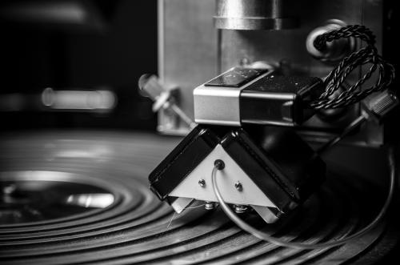

<<<<<<< HEAD
# 为什么MIDI用了这么久现在还在被使用？

很多人会有这样的疑问，MIDI好像被使用了这么久，还有更加盛行的趋势，这到底是为什么？

首先，我们需要先了解一下什么是MIDI ？MIDI(Musical Instrument Digital Interface)乐器数字接口 ，是20 世纪80  年代初为解决电声乐器之间的通信问题而提出的。MIDI是编曲界最广泛的音乐标准格式，可称为“计算机能理解的乐谱”。它用音符的数字控制信号来记录音乐。一首完整的MIDI音乐只有几十KB大，而能包含数十条音乐轨道。几乎所有的现代音乐都是用MIDI加上音色库来制作合成的。MIDI 传输的不是声音信号， 而是音符、控制参数等[指令](https://link.zhihu.com/?target=https%3A//baike.baidu.com/item/%E6%8C%87%E4%BB%A4), 它指示MIDI 设备要做什么，怎么做， 如演奏哪个音符、多大[音量](https://link.zhihu.com/?target=https%3A//baike.baidu.com/item/%E9%9F%B3%E9%87%8F/4277506)等。它们被统一表示成MIDI 消息(MIDI Message) 。传输时采用[异步串行通信](https://link.zhihu.com/?target=https%3A//baike.baidu.com/item/%E5%BC%82%E6%AD%A5%E4%B8%B2%E8%A1%8C%E9%80%9A%E4%BF%A1), 标准通信波特率为31.25×( 1±0.01) KBaud。

换一种更能通俗易通的说法就是，MIDI这项技术就是实现了音乐以可以发声的音符的形式记录在了电脑上，这些声音的记录不仅仅有钢琴，还有鼓、贝斯、合成器之类的乐器。从这我们就能知道MIDI为什么用了这么久。

第一，MIDI这项技术，实现了多个乐器同时演奏出声。三十年前，音乐人没法同时操纵多个乐器，因为当时各种乐器是不可连接的。需要左右手同时弹奏两个键盘。此后，合成器制造商Dave Smith，说服了唱片商采用了一种叫做“乐器数字接口”(Musical Instrument Digital  Interface，MIDI)的通用格式，这种格式能够让合成器受到外部键盘信号控制，可以由唱片商的竞争对手制作，甚至直接从电脑输出。使运算速度足够快的电脑处理音符采样，并能同时控制多个键盘和鼓机。

第二，节省时间、节省空间。这一条和第一条的观点是一样的，因为作曲家不需要每样乐器都和乐手沟通，节省了一部分彩排的时间；而且和乐手沟通和排练是一件相当耗时也是需要空间来完成的，现在MIDI音乐实现了这一可能，让编曲在一个小房子里就能完成很多乐器的同时演奏。

第三，MIDI音乐更加节省资金。因为在作曲家眼里，好的音色的使用，会让一首歌曲变得更加完美，所以要花大量的资金去购买或者租赁各式各样的乐器，那现在我们不用买或者租赁很贵的乐器来实现编曲的音乐质量，现在有非常多好的音源，足够编曲使用。

 还有很多好处在这里就不一一细说了。可以说从MIDI是一项非常伟大的发明，如果有更方便更快捷的方式可以替代它的话也许它会推出历史的舞台，但是不是现在。

=======
# 为什么MIDI用了这么久现在还在被使用？

很多人会有这样的疑问，MIDI好像被使用了这么久，还有更加盛行的趋势，这到底是为什么？

首先，我们需要先了解一下什么是MIDI ？MIDI(Musical Instrument Digital Interface)乐器数字接口 ，是20 世纪80  年代初为解决电声乐器之间的通信问题而提出的。MIDI是编曲界最广泛的音乐标准格式，可称为“计算机能理解的乐谱”。它用音符的数字控制信号来记录音乐。一首完整的MIDI音乐只有几十KB大，而能包含数十条音乐轨道。几乎所有的现代音乐都是用MIDI加上音色库来制作合成的。MIDI 传输的不是声音信号， 而是音符、控制参数等[指令](https://link.zhihu.com/?target=https%3A//baike.baidu.com/item/%E6%8C%87%E4%BB%A4), 它指示MIDI 设备要做什么，怎么做， 如演奏哪个音符、多大[音量](https://link.zhihu.com/?target=https%3A//baike.baidu.com/item/%E9%9F%B3%E9%87%8F/4277506)等。它们被统一表示成MIDI 消息(MIDI Message) 。传输时采用[异步串行通信](https://link.zhihu.com/?target=https%3A//baike.baidu.com/item/%E5%BC%82%E6%AD%A5%E4%B8%B2%E8%A1%8C%E9%80%9A%E4%BF%A1), 标准通信波特率为31.25×( 1±0.01) KBaud。

换一种更能通俗易通的说法就是，MIDI这项技术就是实现了音乐以可以发声的音符的形式记录在了电脑上，这些声音的记录不仅仅有钢琴，还有鼓、贝斯、合成器之类的乐器。从这我们就能知道MIDI为什么用了这么久。

第一，MIDI这项技术，实现了多个乐器同时演奏出声。三十年前，音乐人没法同时操纵多个乐器，因为当时各种乐器是不可连接的。需要左右手同时弹奏两个键盘。此后，合成器制造商Dave Smith，说服了唱片商采用了一种叫做“乐器数字接口”(Musical Instrument Digital  Interface，MIDI)的通用格式，这种格式能够让合成器受到外部键盘信号控制，可以由唱片商的竞争对手制作，甚至直接从电脑输出。使运算速度足够快的电脑处理音符采样，并能同时控制多个键盘和鼓机。

第二，节省时间、节省空间。这一条和第一条的观点是一样的，因为作曲家不需要每样乐器都和乐手沟通，节省了一部分彩排的时间；而且和乐手沟通和排练是一件相当耗时也是需要空间来完成的，现在MIDI音乐实现了这一可能，让编曲在一个小房子里就能完成很多乐器的同时演奏。

第三，MIDI音乐更加节省资金。因为在作曲家眼里，好的音色的使用，会让一首歌曲变得更加完美，所以要花大量的资金去购买或者租赁各式各样的乐器，那现在我们不用买或者租赁很贵的乐器来实现编曲的音乐质量，现在有非常多好的音源，足够编曲使用。

 还有很多好处在这里就不一一细说了。可以说从MIDI是一项非常伟大的发明，如果有更方便更快捷的方式可以替代它的话也许它会推出历史的舞台，但是不是现在。

>>>>>>> f06987277737098e8bf42d04b2262fe3d06e0d8a
**朱弦三叹音乐教育是西安朱弦三叹唱片有限公司的旗下的一所专业音乐教育机构，从事音乐制作教育6年之久，是国内较早的MIDI音乐制作教育机构。朱弦三叹音乐拥有强大的教学资源、师资力量和完善的课程体系，给您一个系统全面的学习计划，助您成为一名合格的音乐制作人！**