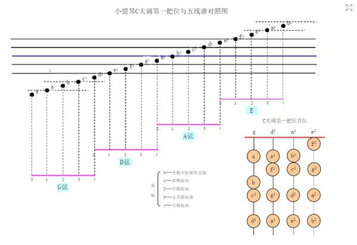

https://zhidao.baidu.com/question/165953290.html

小提琴五线谱和钢琴谱并不完全一样。

四条空弦从粗到细分别是五线谱下加二线的sol、re、la、高音mi，五线谱最下面看起，第一条线上的音是mi，是re弦一指（区别与最细那根弦），接下来就一个音一个音加上去。

乐谱最前面有个高音谱号，（或低音谱号），高音谱号旁边的3/4、4/4代表的是整个乐曲节拍的打法，暂且先不管。还有#、b等符号，代表的是整个乐曲的调号，也就是do/re/mi/fa/sol/la/xi是否有升降。

记住提琴上的四根弦，琴头冲上时，从左到右分别叫做G, D, A, E弦。记住每个手指，中指按弦，食指也可以按弦，无名指和小指决对不可以碰弦。3: 无名指按弦，食指和中指也可以按，小指不可碰弦。小指按弦，其余三指可以按下。

## 扩展资料：

小提琴演奏技巧

小提琴属于歌唱性的旋律乐器。因此，如何在小提琴上发出歌唱般的丰满、动听的声音，是小提琴演奏中最为重要的问题。就小提琴的演奏技术来说，有以下各种主要基本功。

握弓

右手握弓，拇指尖须紧靠螺旋套（弓根），其他手指执住弓杆，使手背成自然弧形。手指需要柔软的弯曲。弓杆位于食指、中指、无名指的末节中（即指端），拇指恰与中指相对，小指的指尖，轻松的放在弓杆上，。四指之间，略须靠拢，不可单独分开，否则显得笨拙而不雅观。

运弓

优秀的演奏家能在小提琴上发出千变万化的声音，就运弓而言，取决于运弓的速度、弓在弦上的压力以及弓和弦的接触点这3种因素的不同结合。小提琴的弓法繁多，就其主要的有以下几种：①分弓：一弓演奏一个音，音要拉的干净。

音准

歌唱和乐器演奏中所发的音高，能与一定律制的音高相符，称为音准。管乐器音准的突出问题是如何矫正偏高。歌唱及弦乐器、管乐器的音准，当有钢琴伴奏时，都以平均律为准则；但由于平均律的许多音程听起来并不严格协和，所以在独唱、独奏、重唱、重奏时，常常需要偏离平均律而趋近纯律或五度相生律，才算达到音准要求。

音级

具有七个唱名（do、re、mi、fa、sol、la、si）或音名（C、D、E、F、G、A、B）中任何一个名称的音，每一音级有数种不同的 音高，用变化音记号区别，各音级之间的相互关系为音乐中一切音高关系的基础。

揉弦

揉弦是一个小提琴演奏很有表现力的技巧，用它可以来表现不同风格和特征的每一个音或每一个乐段。揉弦的要点是怎样找到手的最佳动作，用速度快慢、揉弦宽窄来演奏出每一个乐段独特的风格和特征。

把位

左手手指在指板上的位置，称之为把位。靠近琴头的把位为低把，靠近琴马的为高把。从一个把位换到另一个把位，称为换把。换把位的方法有多种，例如空弦换把，同指换把，不同指以及泛音换把等。换把时产生非演奏需要的滑音，是技巧训练不足的标志。