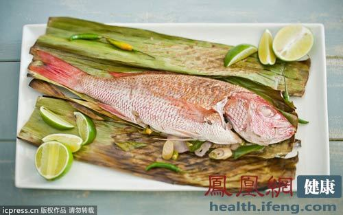

# [原标题：**吃鱼有禁忌 这八种鱼不能搭配的食物](http://travel.cntv.cn/2013/11/27/ARTI1385516618590118_2.shtml) 						

　　鱼类是家喻户晓的健康饮食，其所含的蛋白质以及鱼油是有效降低心血管疾病风险的营养物质，另外，鱼类中的一种特殊脂肪酸对人体的大脑和眼睛发育也有着重要的影响。鱼类虽然美味又健康，因此很多人都喜欢吃鱼，殊不知，鱼也不是随便和什么食物烹饪在一起都可以吃。鱼的烹饪得讲究科学的搭配，如果搭配得不科学，不仅破坏了鱼肉里面原有的营养，而且还有可能对身体健康造成伤害。

　　吃鱼有禁忌这八种鱼不能搭配的食物（华盖/供图）

　　**一、鱼未煮熟**

　　吃了未经煮熟的鱼可能会导致寄生虫感染。当你在家中烹调鱼的时候，请确保鱼肉至易剥落和嫩滑的状态，肉类应没有任何半透明的迹象。不要把还未煮熟的鱼和其它食物的盘子放在一起，避免交叉污染。

　　**二、过度油炸**

　　油炸鱼也可能会使鱼的汞含量上升。鱼类过度油炸，或者与高脂肪、高热量的酱料搭配，很快就会变成一道不健康的膳食。是非常不宜吃鱼肉的时机。

　　**三、含汞量高的鱼类**

　　大多数的鱼类都被汞轻微污染过，大多数健康的成年人体内对分解微量的汞是没有问题的。但怀孕或哺乳的妇女和儿童应避免一些鱼类和贝类，以减轻汞毒的危害。

　　体积较大的鱼类含汞量最高，如鲨鱼、箭鱼、鲭鱼、方头鱼。对于大多数人来说，最好尽量避免食用这些鱼。可以选择用含汞量较少的其它品种的鱼类和贝类替代它们，如虾，鳕鱼，罐装金枪鱼，鲑鱼和鲶鱼等。

　　吃鱼有禁忌这八种鱼不能搭配的食物（华盖/供图）

　　**四、6种人不能吃鱼**

　　如下几种疾病患者忌食鱼：出血性疾病患者忌多食鱼，结核病患者吃药时忌食鱼，痛风患者忌食鱼，肝硬化患者忌食鱼，体质过敏患者忌食鱼，不孕症患者忌食鱼。

　　**吃这八种鱼忌搭配的食物**

　　### 　**【鲫鱼】**

　　性味甘、温，有益气健脾、利水消肿、清热解毒、通络下乳等功能。鲫鱼体内的脂肪有利于心血管功能，还可降低血液粘度，促进血液循环。

　　**忌口：**不能与麦冬、沙参同用，不宜和大蒜、砂糖、芥菜、沙参、蜂蜜、猪肝、鸡肉、野鸡肉、鹿肉同食。阳虚体质和素有内热者不能食用，易生热而生疮疡者也忌食，感冒发热期间不宜多吃。

　　### 　**【鲤鱼】**

　　鲤鱼有健脾开胃、利尿消肿、止咳平喘、安胎通乳、清热解毒等功能。

　　能供给人体必需的氨基酸、矿物质、维生素A和维生素D，并含较多不饱和脂肪酸，能降低胆固醇，防治动脉硬化、冠心病，因此鲤鱼适宜水肿、浮肿、心血管病患者食用。

　　**忌口：**凡患有恶性肿瘤、淋巴结核、红斑狼疮、哮喘、小儿痄腮、血栓闭塞性脉管炎、痈疽、荨麻疹、皮肤湿疹等疾病之人均应忌食；素体阳亢及疮疡者慎食。鲤鱼忌与绿豆、芋头、牛羊油、猪肝、鸡肉、荆芥、甘草、南瓜、狗肉、咸菜同食。

　### 　**【鲢鱼】**

　　可温中补气、暖胃、润泽肌肤，是温中补气养生食品。适用于脾胃虚寒体质、溏便、皮肤干燥者，也可用于产后脾胃气虚所致的少乳等症。

　　**忌口：**凡是脾胃蕴热者不宜食用鲢鱼。另外，感冒发烧、口腔溃疡、大便秘结者、瘙痒性皮肤病、荨麻疹、癣病患者都应忌食鲢鱼。

　　### 　**【草鱼】**

　　可以开胃、滋补，暖胃和中、平降肝阳、祛风、治痹、截疟、益肠明眼目，很适合身体瘦弱、食欲不振的人吃。它含有丰富的不饱和脂肪酸，对血液循环有利，是心血管病人的良好食物；含有丰富的硒元素，经常食用有抗衰老、养颜的功效，而且对肿瘤也有一定的防治作用。

　　**忌口：**不宜多吃，多吃则易发疮疡。另外，女性在经期食用草鱼容易产生疲倦感、出现水肿症状。

　　　### **【鳜鱼】**

　　性味甘、平，适宜体质衰弱、虚劳羸瘦、脾胃气虚、饮食不香，营养不良之人食用。

　　**忌口：**体内寒湿盛者、咯血、哮喘病人不宜食用鳜鱼。

　　　### **【带鱼】**

　　性温、味甘、咸，有补脾、益气、暖胃、养肝、润肤、补气、养血、健美的作用，，可用作迁延性肝炎、慢性肝炎的辅助治疗。适宜久病体虚，血虚头晕，气短乏力，营养不良之人食用。

　　**忌口：**多食易动风发疥，过敏体质者、有麻疹、风疹及原因不明的皮肤瘙痒者，不宜食用，咳嗽气喘者也不宜食用。另外，带鱼不能喝甘草、荆芥一起吃，并且忌用牛油、羊油煎炸，否则食后更易动风。

　### **【鲳鱼】**

　　性味甘、平、淡，具有益气养血、补胃益精、滑利关节、柔筋利骨之功效，尤其适合消化不良、脾虚泄泻、贫血、筋骨酸痛者食用。

　　**忌口：**瘙痒性皮肤病患者应忌食。再者其鱼子有毒，不可食用。另外，鲳鱼也不能用牛、羊油煎炸。

### **【黄花鱼】**

　　性味甘、平，能健脾益气，开胃消食，含有丰富的蛋白质、微量元素和维生素，对人体有很好的补益作用。

　　黄花鱼含有丰富的蛋白质、微量元素和维生素，能清除人体代谢产生的自由基，能延缓衰老，并对各种癌症有防治功效。尤其对体质虚弱和中老年人来说，食用黄花鱼会收到很好的食疗效果。

　　**忌口：**胃呆痰多者、哮喘病人、过敏体质者、体胖内热者应慎食。同时，黄花鱼不能与中药荆芥、荞麦一起吃，不能用牛、羊油煎炸。