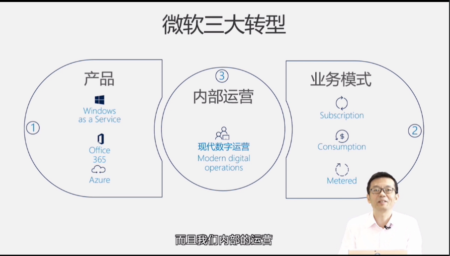
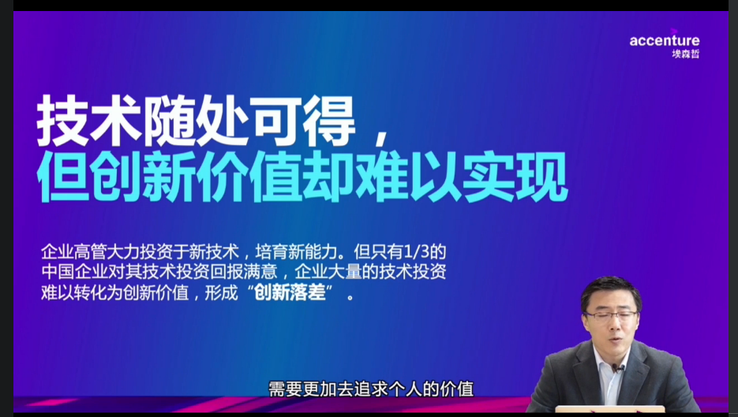
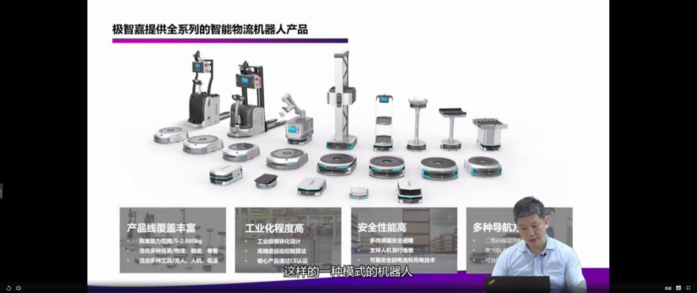
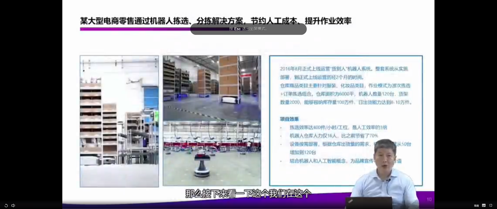
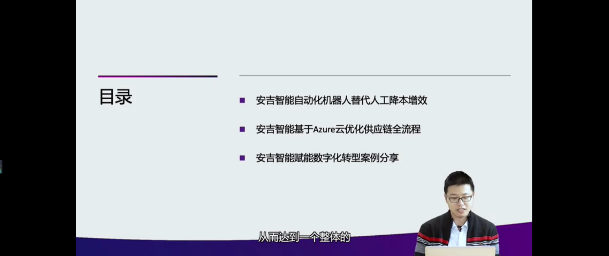
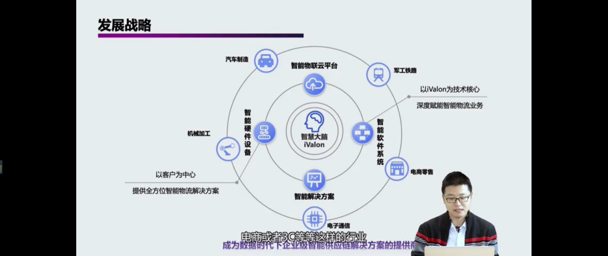
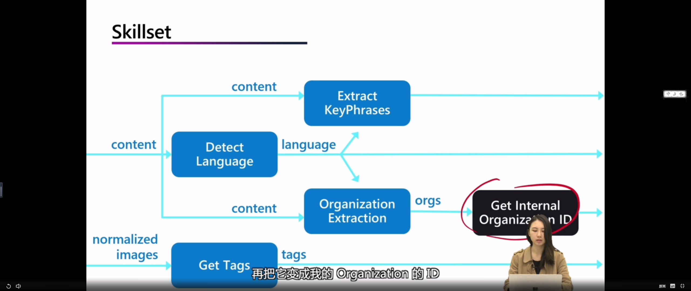

## 疫后再谈数字化转型对我们的启示

## 

 

教育

****

有选择。话语权

人机互动

没

****

****

****

；连接 部署

聚合	对接

## 编排

\

VRED 

汽车行业

## Saas

## AI 知识挖掘：使用 Azure 搜索内置 AI 能力从内容中挖掘知识2

### 认知服务

、

索引

https://techforum.microsoft.com/virtualsummit/zh-cn/detail?channel_id=100001&schedule_id=37

## Task

